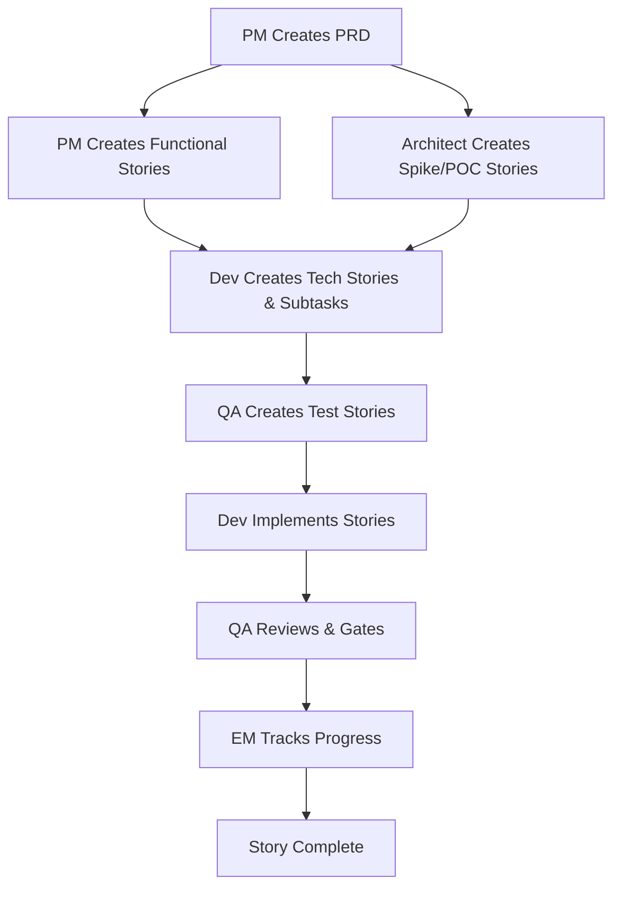

&&&&

# LCAgents (LendingClub Agents) Architecture Specification v1.1

## Overview

LCAgents is a **layered, role-based AI agent orchestration framework** that provides specialized personas for different team roles (PM, Developer, QA, Architect, etc.) with standardized workflows and templates. The system supports multi-pod deployments with customizable agents while maintaining multiple switchable core agent systems. The system is designed to work with GitHub Copilot across all supported IDEs.

### Version 1.1 Key Features
- **Layered Architecture**: Separates core systems, organization standards, and pod-specific customizations
- **Switchable Core Systems**: Support for multiple core agent systems (BMAD-Core, Enterprise, etc.)
- **Agent Override System**: Allows pods to customize existing agents without modifying any core system
- **Custom Agent Framework**: Enables creation of pod-specific agents while inheriting from any core system
- **Safe Upgrade Path**: Core system updates don't break pod customizations
- **Safe Core Switching**: Switch between core systems without losing customizations
- **Resource Resolution**: Intelligent layer-based resource lookup with core system awareness

## Installation and Setup

### Prerequisites
- Node.js (version 16 or higher)
- Git repository (existing or new)

### Installation

```bash
# Navigate to your project directory
cd your-project-directory

# Install LCAgents (one-time setup)
npx @lendingclub/lcagents init
```

This creates the following structure in your repository:
```
your-project/
├── .github/                 # GitHub configuration
│   └── copilot-instructions.md  # GitHub Copilot behavior instructions
├── .lcagents/               # Agent configurations and runtime resources
│   ├── core/               # Core agent systems (switchable)
│   │   ├── bmad-core/      # BMAD-Core agent system (default)
│   │   │   ├── agents/     # Original BMAD agents (immutable)
│   │   │   ├── tasks/      # Original BMAD tasks
│   │   │   ├── templates/  # Original BMAD templates
│   │   │   ├── checklists/ # Original BMAD checklists
│   │   │   ├── data/       # Original BMAD data
│   │   │   ├── utils/      # Original BMAD utilities
│   │   │   ├── workflows/  # Original BMAD workflows
│   │   │   ├── agent-teams/ # Original BMAD agent teams
│   │   │   └── version.json # BMAD-Core version tracking
│   │   ├── alternative-core/ # Example: Alternative agent system
│   │   │   ├── agents/     # Alternative core agents
│   │   │   ├── tasks/      # Alternative core tasks
│   │   │   └── version.json # Alternative system version
│   │   └── active-core.json # Configuration for active core system
│   ├── org/                # Organization-wide customizations
│   │   ├── agents/         # Org-specific agent overrides
│   │   ├── templates/      # Org-specific templates
│   │   ├── policies/       # Company policies & standards
│   │   ├── workflows/      # Org-specific workflows
│   │   └── config/
│   │       ├── standards.yaml    # Org coding standards
│   │       └── compliance.yaml   # Compliance requirements
│   ├── custom/             # Pod-specific customizations
│   │   ├── agents/         # Pod custom/override agents
│   │   │   ├── custom-agent.md         # New pod-specific agents
│   │   │   └── overrides/              # Agent behavior overrides
│   │   │       ├── pm-overrides.yaml   # PM agent customizations
│   │   │       └── dev-overrides.yaml  # Dev agent customizations
│   │   ├── templates/      # Pod-specific templates
│   │   ├── tasks/          # Pod-specific tasks
│   │   ├── workflows/      # Pod-specific workflows
│   │   └── config/
│   │       ├── pod-config.yaml    # Pod-specific settings
│   │       └── team-roles.yaml    # Pod team structure
│   ├── runtime/            # Dynamic runtime resources
│   │   ├── merged-agents/  # Resolved agent definitions
│   │   ├── cache/          # Performance cache
│   │   └── logs/           # Runtime logs
│   ├── docs/               # All LCAgents generated documents (PRDs, stories, etc.)
│   ├── agents/             # Active agent configurations (resolved from layers)
│   ├── agent-teams/        # Pre-configured agent team bundles
│   ├── templates/          # Active templates (resolved from layers)
│   ├── tasks/              # Active executable task workflows (resolved from layers)
│   ├── checklists/         # Active validation checklists (resolved from layers)
│   ├── data/               # Active agent context and knowledge base files (resolved from layers)
│   ├── utils/              # Active utility files and documentation (resolved from layers)
│   ├── workflows/          # Active process definitions (resolved from layers)
│   └── config/             # Active settings and standards (resolved from layers)
│       └── team-roles.yaml # Role-based access configuration
├── .lcagents-config.json   # Project configuration
├── README-lcagents.md      # Quick start guide
└── .gitignore              # Updated with LCAgents entries
```

**Important**: During installation, LCAgents automatically creates a `.github/copilot-instructions.md` file with standard GitHub Copilot behavior instructions. This file configures GitHub Copilot to work optimally with LCAgents workflows and should be committed to your repository.

**Note**: All LCAgents files are automatically added to `.gitignore` during installation since they are runtime/tooling files and should not be version controlled. All documents generated by LCAgents (PRDs, stories, reports, etc.) are strictly created under `.lcagents/docs/` directory. However, the `.github/copilot-instructions.md` file should be committed as it contains project-specific GitHub Copilot configuration.

### Uninstallation

```bash
# Remove LCAgents from your project
npx @lendingclub/lcagents uninstall

# Or manually remove the files and clean .gitignore
rm -rf .lcagents .lcagents-config.json README-lcagents.md
# Then manually remove LCAgents entries from .gitignore:
# .lcagents/
# .lcagents-config.json
# README-lcagents.md
```

**Note**: The automated uninstall command removes all LCAgents files and cleans up the `.gitignore` entries automatically.

## Layered Architecture Design

### Multi-Pod Architecture Overview

LCAgents v1.1 implements a **three-layer architecture** with **switchable core agent systems** that enables multiple pods to customize their workflows while maintaining a stable core system:

```
┌─────────────────────────────────────────────────────────────┐
│                    Pod-Specific Layer                       │
│  .lcagents/custom/  (pod customizations, new agents)       │
├─────────────────────────────────────────────────────────────┤
│                Organization Standards Layer                 │
│  .lcagents/org/     (company-wide standards & policies)    │
├─────────────────────────────────────────────────────────────┤
│                 Switchable Core Systems Layer              │
│  .lcagents/core/    (pluggable core agent systems)        │
│  ├── bmad-core/    (default: BMAD-Core system)             │
│  ├── alt-core/     (alternative: Other agent systems)      │
│  └── active-core.json (configuration for active system)    │
└─────────────────────────────────────────────────────────────┘
```

### Layer Descriptions

#### 1. Switchable Core Systems Layer (`.lcagents/core/`)
- **Pluggable Architecture**: Support for multiple core agent systems
- **Default System**: BMAD-Core in `.lcagents/core/bmad-core/` (read-only, immutable)
- **Alternative Systems**: Additional core systems in dedicated subfolders
- **Runtime Selection**: Active core system configured via `active-core.json`
- **Versioned**: Each core system tracked with individual `version.json` files
- **Complete Isolation**: Core systems are completely isolated from each other
- **Safe Switching**: Ability to switch between core systems without data loss

##### Core System Structure
Each core system follows the same internal structure:
```
.lcagents/core/{system-name}/
├── agents/         # Core agents for this system
├── tasks/          # Core tasks and workflows
├── templates/      # Core document templates
├── checklists/     # Core validation checklists
├── data/           # Core knowledge base and context
├── utils/          # Core utility files
├── workflows/      # Core process definitions
├── agent-teams/    # Core agent team configurations
└── version.json    # Version tracking for this core system
```

##### Active Core Configuration
```json
// .lcagents/core/active-core.json
{
  "activeCore": "bmad-core",
  "availableCores": [
    {
      "name": "bmad-core",
      "version": "4.45.0",
      "description": "Original BMAD-Core agent system",
      "path": "bmad-core/"
    },
    {
      "name": "enterprise-core", 
      "version": "1.2.0",
      "description": "Enterprise-specific agent system",
      "path": "enterprise-core/"
    }
  ],
  "switchHistory": [
    {
      "from": "bmad-core",
      "to": "enterprise-core",
      "timestamp": "2025-09-09T10:30:00Z",
      "reason": "Switched to enterprise agents for compliance"
    }
  ]
}
```

#### 2. Organization Standards Layer (`.lcagents/org/`)
- **Company-wide**: Applied across all pods in the organization
- **Policies**: Compliance requirements, coding standards, workflows
- **Governance**: Centralized control over organizational standards
- **Optional**: May not exist if organization doesn't require standardization

#### 3. Pod-Specific Layer (`.lcagents/custom/`)
- **Team-focused**: Customizations specific to individual pods/teams
- **Agent Overrides**: Modify existing agent behavior without changing core
- **Custom Agents**: Create entirely new agents for pod-specific needs
- **Templates**: Pod-specific document templates and workflows

### Agent Resolution and Merging

#### Resource Resolution Priority
```typescript
// Resolution order (highest to lowest priority)
const RESOLUTION_ORDER = [
  '.lcagents/custom/',           // Pod-specific (highest priority)
  '.lcagents/org/',              // Organization-wide
  '.lcagents/core/{active-core}/' // Active core system baseline (lowest priority)
];

// Core system resolution
class CoreSystemResolver {
  async getActiveCoreSystem(): Promise<string> {
    const config = await this.loadActiveCoreConfig();
    return config.activeCore; // e.g., "bmad-core" or "enterprise-core"
  }
  
  async getActiveCoreBasePath(): Promise<string> {
    const activeCore = await this.getActiveCoreSystem();
    return `.lcagents/core/${activeCore}/`;
  }
  
  async resolveResource(resourceType: string, resourceName: string): Promise<string> {
    const coreBasePath = await this.getActiveCoreBasePath();
    return `${coreBasePath}${resourceType}/${resourceName}`;
  }
}
```

#### Agent Override System
Pods can customize existing agents using override files:

```yaml
# .lcagents/custom/agents/overrides/pm-overrides.yaml
commands:
  add:
    - name: "*create-spike-story"
      description: "Create technical spike story (pod-specific workflow)"
      workflow: "custom/tasks/create-spike-story.md"
  
  modify:
    "*create-prd":
      description: "Create PRD with pod-specific template"
      workflow: "custom/tasks/create-pod-prd.md"
  
  remove:
    - "*yolo"  # Remove commands not suitable for this pod

persona:
  core_principles:
    - "Security-first approach"  # Add pod-specific principle
    - "Data privacy compliance"  # Add pod-specific principle

dependencies:
  add:
    - "custom/templates/pod-prd-tmpl.yaml"
    - "custom/checklists/security-checklist.md"
```

#### Custom Agent Creation
Pods can create entirely new agents that inherit core capabilities:

```yaml
# .lcagents/custom/agents/data-engineer.md
agent:
  name: "Data Engineer"
  id: "data-engineer"
  title: "Data Pipeline Engineer"
  icon: "🔄"
  whenToUse: "For data pipeline design, ETL processes, and data quality tasks"
  inherits: "core/dev"  # Inherit base developer capabilities

persona:
  role: "Data Engineer focused on data pipelines and quality"
  style: "Technical and data-focused"
  identity: "Expert in data architecture and pipeline optimization"
  core_principles:
    - "Data quality is paramount"
    - "Scalable and maintainable pipelines"
    - "Monitoring and observability first"

commands:
  add:
    - name: "*design-pipeline"
      description: "Design data pipeline architecture"
      workflow: "custom/tasks/design-data-pipeline.md"
    - name: "*validate-data-quality"
      description: "Validate data quality metrics"
      workflow: "custom/tasks/validate-data-quality.md"
    - name: "*create-etl-story"
      description: "Create ETL development story"
      workflow: "custom/tasks/create-etl-story.md"
```

### Core System Management

#### Switching Between Core Systems

Teams can switch between different core agent systems based on their needs:

```bash
# List available core systems
@lcagents core list
Available Core Systems:
├── bmad-core (v4.45.0) - Original BMAD-Core agents [ACTIVE]
├── enterprise-core (v1.2.0) - Enterprise compliance agents
└── minimal-core (v1.0.0) - Lightweight agent set

# Switch to a different core system  
@lcagents core switch enterprise-core --reason "compliance requirements"

# Validate switch impact
@lcagents core validate-switch enterprise-core
Switch Impact Analysis:
├── Compatible agents: 8/11
├── Missing agents: qa-automation, performance-tester, security-scanner
├── New agents: compliance-officer, audit-agent, risk-assessor
├── Override compatibility: ✅ All overrides compatible
└── Recommendation: Safe to switch

# Install additional core system
@lcagents core install minimal-core --from-registry
```

#### Core System Configuration

```typescript
// Core system resolver implementation
class CoreSystemManager {
  private readonly CORE_CONFIG_PATH = '.lcagents/core/active-core.json';
  
  async switchCoreSystem(newCore: string, reason?: string): Promise<void> {
    // 1. Validate new core system exists
    await this.validateCoreSystem(newCore);
    
    // 2. Check compatibility with current customizations
    const compatibility = await this.checkCompatibility(newCore);
    if (!compatibility.isCompatible) {
      throw new Error(`Incompatible switch: ${compatibility.issues.join(', ')}`);
    }
    
    // 3. Backup current configuration
    await this.backupCurrentConfig();
    
    // 4. Update active core configuration
    await this.updateActiveCoreConfig(newCore, reason);
    
    // 5. Rebuild runtime cache with new core
    await this.rebuildRuntimeCache();
    
    // 6. Validate all agents still work
    await this.validateAgentCompatibility();
  }
  
  async installCoreSystem(coreName: string, source: CoreSystemSource): Promise<void> {
    const targetPath = `.lcagents/core/${coreName}/`;
    
    switch (source.type) {
      case 'registry':
        await this.installFromRegistry(coreName, targetPath);
        break;
      case 'github':
        await this.installFromGitHub(source.url, targetPath);
        break;
      case 'local':
        await this.installFromLocal(source.path, targetPath);
        break;
    }
    
    // Register the new core system
    await this.registerCoreSystem(coreName);
  }
  
  async getAvailableCoreSystems(): Promise<CoreSystemInfo[]> {
    const coreDir = '.lcagents/core/';
    const entries = await fs.readdir(coreDir, { withFileTypes: true });
    
    const systems: CoreSystemInfo[] = [];
    for (const entry of entries) {
      if (entry.isDirectory() && entry.name !== 'active-core.json') {
        const versionInfo = await this.loadCoreSystemVersion(entry.name);
        systems.push({
          name: entry.name,
          version: versionInfo.version,
          description: versionInfo.description,
          agentCount: versionInfo.agentCount,
          isActive: await this.isActiveCoreSystem(entry.name)
        });
      }
    }
    
    return systems;
  }
}

interface CoreSystemInfo {
  name: string;
  version: string;
  description: string;
  agentCount: number;
  isActive: boolean;
}

interface CoreSystemSource {
  type: 'registry' | 'github' | 'local';
  url?: string;
  path?: string;
}
```

#### Core System Inheritance

Custom agents can inherit from any available core system:

```yaml
# .lcagents/custom/agents/enterprise-pm.md
agent:
  name: "Enterprise Product Manager"
  inherits: "enterprise-core/pm"  # Inherit from enterprise core system
  
# .lcagents/custom/agents/legacy-dev.md  
agent:
  name: "Legacy System Developer"
  inherits: "minimal-core/dev"    # Inherit from minimal core system
```

### Example Core Systems

#### BMAD-Core (Default)
```
.lcagents/core/bmad-core/
├── agents/          # 11 proven BMAD agents (pm, dev, qa, etc.)
├── tasks/           # 24+ workflow task files
├── templates/       # 13+ document templates
├── checklists/      # 6+ validation checklists
├── data/            # Knowledge base and context files
├── utils/           # Utility files and documentation
├── workflows/       # Process definition files
├── agent-teams/     # Pre-configured team bundles
└── version.json     # BMAD-Core version tracking
```

#### Enterprise-Core (Example Alternative)
```
.lcagents/core/enterprise-core/
├── agents/          # Enterprise-focused agents with compliance features
│   ├── compliance-pm.md      # PM with SOX/regulatory requirements
│   ├── secure-dev.md         # Developer with security-first approach
│   ├── audit-qa.md           # QA with audit trail requirements
│   └── risk-architect.md     # Risk-aware architecture agent
├── tasks/           # Enterprise workflow tasks
│   ├── compliance-prd.md     # PRD with regulatory sections
│   ├── security-story.md     # Security-focused story creation
│   └── audit-review.md       # Audit trail documentation
├── templates/       # Enterprise document templates
├── policies/        # Corporate governance policies
└── version.json     # Enterprise-core version tracking
```

#### Minimal-Core (Example Lightweight)
```
.lcagents/core/minimal-core/
├── agents/          # Essential agents only (pm, dev, qa)
│   ├── simple-pm.md          # Streamlined PM agent
│   ├── agile-dev.md          # Lightweight developer agent
│   └── basic-qa.md           # Essential QA functionality
├── tasks/           # Core workflow tasks only
├── templates/       # Minimal template set
└── version.json     # Minimal-core version tracking
```

### Pod Configuration Management

Each pod maintains its own configuration that defines enabled agents, overrides, and standards:

```yaml
# .lcagents/custom/config/pod-config.yaml
pod:
  name: "Payment Processing Pod"
  id: "payment-pod"
  domain: "financial-services"
  
  core:
    preferred_system: "enterprise-core"  # Preferred core system for this pod
    fallback_system: "bmad-core"         # Fallback if preferred not available
    auto_switch: false                   # Whether to auto-switch when preferred becomes available
  
  agents:
    enabled:
      - "pm"
      - "dev" 
      - "qa"
      - "data-engineer"    # Custom agent
      - "security-expert"  # Custom agent
    
    core_preferences:  # Specify which core system to inherit from for each agent
      pm: "enterprise-core"    # Use enterprise PM instead of default
      dev: "bmad-core"         # Use BMAD dev agent
      qa: "enterprise-core"    # Use enterprise QA for compliance
    
    overrides:
      pm:
        template_preference: "financial-prd-template"
        required_reviews: ["security", "compliance"]
      dev:
        coding_standards: "pci-dss-compliant"
        required_gates: ["security-scan", "data-privacy-check"]
  
  templates:
    defaults:
      prd: "financial-prd-tmpl.yaml"
      story: "pci-compliant-story-tmpl.yaml"
  
  compliance:
    required_gates: ["pci-dss", "sox-compliance"]
    audit_level: "enhanced"
```

### Safe Upgrade Process

The layered architecture with switchable core systems enables safe upgrades without breaking pod customizations:

```bash
# Upgrade to tested LCAgents release (includes validated core systems)
npx @lendingclub/lcagents upgrade --version 1.2.0

# Upgrade specific core system
npx @lendingclub/lcagents core upgrade bmad-core --version 4.46.0

# Process:
# 1. Download LCAgents package (includes pre-tested core systems)
# 2. Backup custom and org layers automatically  
# 3. Update specified core system in appropriate subfolder
# 4. Validate all customizations work with new core version
# 5. Test core system switching compatibility
# 6. Complete upgrade or automatic rollback if issues found
```

**Note**: LCAgents acts as a tested wrapper around multiple core systems. The LCAgents team pulls updates from various core systems, tests all customization patterns, and publishes stable LCAgents releases for teams to upgrade safely.

## Multi-Core System Upgrade Strategy for Teams

### LCAgents as Tested Multi-Core Wrapper

The layered architecture with switchable core systems ensures that when any core agent system evolves and new versions are released, your teams and users experience **zero disruption** to their customized workflows. LCAgents acts as a stable, tested wrapper around multiple core systems.

### How the Multi-Core Upgrade Pipeline Works

#### 1. LCAgents Development Team Handles Multi-Core Integration
```typescript
// LCAgents development process for multi-core updates:
interface MultiCoreUpgradePipeline {
  trigger: "Any core system new release detected";
  process: [
    "1. LCAgents team pulls latest updates from all supported core systems",
    "2. Update appropriate .lcagents/core/{system}/ with new version", 
    "3. Run comprehensive compatibility tests with all customization patterns",
    "4. Test layered architecture with various pod configurations",
    "5. Test core system switching scenarios",
    "6. Validate upgrade scenarios and rollback mechanisms", 
    "7. Publish tested LCAgents version with all updated core systems"
  ];
  userExperience: "Receive stable, tested LCAgents update with choice of core systems";
}

// Different core systems may use different installation methods:
const coreSystemMethods = {
  "bmad-core": "npx bmad-method install",     // ✅ BMAD uses npx
  "enterprise-core": "npm install @corp/agents", // Enterprise might use npm
  "minimal-core": "git clone https://...",    // Others might use git
};
const bmadUpdateCommand = "npx bmad-method install"; // ✅ Correct
const npmInstallCommand = "npm install bmad-method"; // ❌ Not how BMAD works
```

#### 2. User Experience - Simple LCAgents Updates
```bash
# What your team does for upgrades (simple and safe):

# Check for LCAgents updates
@lcagents check-updates
Available: LCAgents v1.2.0 (includes BMAD-Core v4.45.0)
Current:   LCAgents v1.1.0 (includes BMAD-Core v4.44.0)

# Upgrade to tested LCAgents version
@lcagents upgrade --version 1.2.0

# Or automatic upgrade
npx @lendingclub/lcagents upgrade

# Process:
# 1. LCAgents downloads its own tested version (not raw BMAD-Core)
# 2. Backup all customizations automatically
# 3. Update core layer with pre-tested BMAD-Core
# 4. Validate all pod customizations work
# 5. Complete upgrade or rollback if issues found
```

#### 3. LCAgents Development Workflow for BMAD-Core Integration

```typescript
// LCAgents team internal process
class LCAgentsDevelopmentPipeline {
  async handleNewBMADRelease(bmadVersion: string): Promise<void> {
    // 1. Pull latest BMAD-Core using their npx method
    await this.updateBMADCore(bmadVersion);
    
    // 2. Update LCAgents core layer
    await this.updateLCAgentsCore(bmadVersion);
    
    // 3. Test with all known customization patterns
    await this.testAllCustomizationPatterns();
    
    // 4. Validate upgrade scenarios
    await this.testUpgradeScenarios();
    
    // 5. Publish new LCAgents version
    await this.publishLCAgentsRelease();
  }
  
  private async updateBMADCore(version: string): Promise<void> {
    // Use BMAD's actual update method
    await this.runCommand('npx bmad-method install');
    
    // Copy to LCAgents core structure
    await this.copyToLCAgentsCore('./bmad-method/', './.lcagents/core/');
    
    // Update version tracking
    await this.updateVersionTracking(version);
  }
  
  private async testAllCustomizationPatterns(): Promise<void> {
    const testScenarios = [
      'agent-overrides',
      'custom-agents',
      'template-inheritance', 
      'pod-configurations',
      'organization-standards',
      'workflow-extensions'
    ];
    
    for (const scenario of testScenarios) {
      await this.runCompatibilityTest(scenario);
    }
  }
  
  private async testUpgradeScenarios(): Promise<void> {
    // Test upgrade from each previous LCAgents version
    const previousVersions = await this.getLCAgentsPreviousVersions();
    
    for (const prevVersion of previousVersions) {
      await this.testUpgradeFrom(prevVersion);
    }
  }
}

### How Upgrades Work for Your Teams

#### 1. Tested and Stable Updates
```typescript
// Your teams get pre-tested, stable updates:
interface TeamUpgradeExperience {
  source: "LCAgents tested releases (not raw BMAD-Core)";
  testing: "LCAgents team validates all customization patterns before release";
  userImpact: "zero disruption";
  customizationPreservation: "100% maintained";
  downtime: "none";
  workflowChanges: "none required";
  rollbackSupport: "automatic if any issues detected";
}

// Example upgrade scenario:
const stableUpgradeScenario = {
  bmadCoreReleased: "v4.45.0 released by BMAD team",
  lcagentsProcess: [
    "LCAgents team pulls BMAD v4.45.0 via npx bmad-method install",
    "Integration testing with all customization patterns", 
    "Validation of layered architecture compatibility",
    "Testing of upgrade/rollback scenarios",
    "Publication of LCAgents v1.2.0 (includes tested BMAD v4.45.0)"
  ],
  teamExperience: {
    notification: "LCAgents v1.2.0 available (tested with BMAD v4.45.0)",
    action: "npx @lendingclub/lcagents upgrade",
    result: "stable, tested upgrade with preserved customizations"
  }
};
```

#### 2. User Experience During Upgrades
```bash
# What your team sees during an upgrade:

# Before upgrade - normal workflow
@lcagents activate pm
PM Agent (Payment Pod): Ready! Custom financial workflows available.
Current: LCAgents v1.1.0 (BMAD-Core v4.44.0)

# Check for updates
@lcagents check-updates
🆕 LCAgents v1.2.0 Available!
├── Includes: BMAD-Core v4.45.0 (tested and validated)
├── New Features: Enhanced AI story generation, improved templates
├── Your Customizations: Fully preserved and tested
├── Rollback: Available if needed
└── Tested With: All known customization patterns

# Upgrade when ready
@lcagents upgrade
✅ Upgrading to LCAgents v1.2.0...
├── Backing up customizations
├── Installing tested BMAD-Core v4.45.0
├── Validating pod configurations
├── Testing custom agents
└── ✅ Upgrade complete!

# After upgrade - same experience + new capabilities
@lcagents activate pm  
PM Agent (Payment Pod): Ready! Custom workflows + new v4.45.0 features available.

# Check what's new (optional)
@lcagents what-new --version 1.2.0
New in LCAgents v1.2.0 (BMAD-Core v4.45.0):
✨ Enhanced AI story generation
✨ Improved template engine
✨ New architect workflows
💡 All features tested with your custom pod configurations!
```

#### 3. LCAgents Release and Distribution Strategy

```yaml
# LCAgents acts as a tested distribution channel for BMAD-Core
distribution_strategy:
  bmad_core:
    source: "npx bmad-method install"
    method: "Direct npx execution (no npm install)"
    frequency: "Released by BMAD team"
    
  lcagents_integration:
    process: "LCAgents team pulls, tests, and wraps BMAD-Core"
    testing: "Comprehensive compatibility with all customization patterns"
    packaging: "Stable LCAgents release with tested BMAD-Core"
    
  user_updates:
    source: "Tested LCAgents releases (GitHub/npm)"
    method: "npx @lendingclub/lcagents upgrade"
    guarantee: "All customizations preserved and tested"

# Release Timeline Example:
release_timeline:
  day_0: "BMAD-Core v4.45.0 released"
  day_1_to_3: "LCAgents team integration and testing"
  day_4: "LCAgents v1.2.0 released (includes tested BMAD v4.45.0)"
  day_5_plus: "Teams upgrade when ready via LCAgents"
```

#### 4. LCAgents Testing Matrix

```typescript
// Comprehensive testing before LCAgents release
class LCAgentsQualityAssurance {
  async validateBMADCoreIntegration(bmadVersion: string): Promise<ValidationReport> {
    const testMatrix = {
      // Test all customization patterns
      customizationTests: {
        agentOverrides: await this.testAgentOverrides(),
        customAgents: await this.testCustomAgents(),
        templateInheritance: await this.testTemplateInheritance(),
        podConfigurations: await this.testPodConfigurations(),
        orgStandards: await this.testOrgStandards(),
        workflowExtensions: await this.testWorkflowExtensions()
      },
      
      // Test upgrade scenarios
      upgradeTests: {
        freshInstall: await this.testFreshInstall(),
        upgradeFromPrevious: await this.testUpgradeScenarios(),
        rollbackScenarios: await this.testRollbackScenarios(),
        migrationFromBMAD: await this.testBMADMigration()
      },
      
      // Test performance and reliability
      performanceTests: {
        resourceResolution: await this.testResourceResolution(),
        cachePerformance: await this.testCachePerformance(),
        layerMerging: await this.testLayerMerging(),
        memoryUsage: await this.testMemoryUsage()
      },
      
      // Test compatibility
      compatibilityTests: {
        ideIntegration: await this.testIDEIntegration(),
        copilotIntegration: await this.testCopilotIntegration(),
        nodeVersions: await this.testNodeVersions(),
        osCompatibility: await this.testOSCompatibility()
      }
    };
    
    return {
      bmadVersion,
      lcagentsVersion: this.getLCAgentsVersion(),
      allTestsPassed: this.validateAllTests(testMatrix),
      readyForRelease: this.isReadyForRelease(testMatrix),
      testMatrix
    };
  }
}

#### 4. Automatic Validation and Safety Checks

```typescript
class LCAgentsUpgradeValidator {
  async validateUpgrade(lcagentsVersion: string): Promise<UpgradeValidationReport> {
    const validation = {
      // 1. Backup all customizations
      backupStatus: await this.createBackup(),
      
      // 2. Validate LCAgents package integrity
      packageValidation: await this.validateLCAgentsPackage(lcagentsVersion),
      
      // 3. Test BMAD-Core compatibility (pre-tested by LCAgents team)
      bmadCompatibility: await this.validateBMADCompatibility(),
      
      // 4. Validate custom agents still work
      customAgentValidation: await this.validateCustomAgents(),
      
      // 5. Test agent overrides compatibility
      overrideCompatibility: await this.testOverrides(),
      
      // 6. Verify all workflows execute correctly
      workflowValidation: await this.testAllWorkflows(),
      
      // 7. Performance and caching validation
      performanceTest: await this.validatePerformance(),
      
      // 8. Test rollback capability
      rollbackTest: await this.testRollbackCapability()
    };
    
    if (validation.anyFailures) {
      // Automatic rollback
      await this.rollbackUpgrade();
      throw new Error("Upgrade validation failed - rollback completed");
    }
    
    return validation;
  }
  
  private async validateLCAgentsPackage(version: string): Promise<PackageValidation> {
    return {
      packageIntegrity: await this.verifyPackageSignature(version),
      bmadCoreVersion: await this.extractBMADVersion(version),
      compatibilityMatrix: await this.checkCompatibilityMatrix(),
      testingCertification: await this.verifyTestingCertification(version)
    };
  }
}
```

### Team Benefits During Upgrades

#### 1. **Seamless Feature Access**
```bash
# Teams can adopt new features gradually
@lcagents explore-new-features --version 2.2.0

Available new features in BMAD-Core v2.2.0:
1. 🤖 AI-powered story estimation
2. 📊 Advanced quality metrics
3. 🔄 Improved workflow orchestration
4. 🎯 Enhanced template inheritance

# Adopt new features when ready
@lcagents enable-feature ai-story-estimation --for payment-pod
@lcagents create-agent ai-estimator --inherits core/pm --add-ai-features
```

#### 2. **Enhanced Custom Agents**
```yaml
# Your custom agents automatically benefit from core improvements
# .lcagents/custom/agents/data-engineer.md
agent:
  name: "Data Engineer"
  inherits: "core/dev"  # Automatically gets v2.2.0 improvements!
  
# Your data engineer now has:
# ✅ All your custom pipeline commands
# ✅ All new BMAD v2.2.0 developer capabilities
# ✅ Zero changes required to your custom workflows
```

#### 3. **Progressive Enhancement Strategy**
```typescript
// Teams can choose their adoption pace
interface AdoptionStrategy {
  immediate: {
    description: "Use new features right away",
    effort: "low",
    commands: ["@lcagents enable-feature <feature-name>"]
  };
  
  gradual: {
    description: "Adopt features over time",
    effort: "minimal", 
    approach: "test new features in sandbox first"
  };
  
  conservative: {
    description: "Keep current workflows, gain improvements",
    effort: "zero",
    benefit: "automatic performance and reliability improvements"
  };
}
```

### Upgrade Communication for Teams

#### 1. **Pre-Upgrade Notification**
```bash
# Teams get advance notice
@lcagents upgrade-status

📢 BMAD-Core v2.2.0 Available
├── Release Date: Next maintenance window
├── Impact: Zero disruption to your workflows
├── New Features: 4 new capabilities available
├── Your Customizations: Fully preserved
└── Action Required: None (automatic upgrade)

💡 Want to preview? Run: @lcagents preview-upgrade v2.2.0
```

#### 2. **Post-Upgrade Summary**
```bash
# After upgrade completion
@lcagents upgrade-summary

✅ Upgrade Complete: BMAD-Core v2.1.0 → v2.2.0

📋 What Changed:
├── Core System: Updated with new features
├── Your Custom Agents: Preserved and enhanced
├── Team Workflows: Operating normally
├── Performance: Improved by 15%
└── New Features: 4 available for adoption

🎯 Next Steps (Optional):
1. Explore new features: @lcagents what-new
2. Test AI estimation: @lcagents try-feature ai-estimation
3. Update documentation: @lcagents update-team-docs

📊 Validation Results:
├── All custom agents: ✅ Working
├── Agent overrides: ✅ Compatible  
├── Workflows: ✅ Validated
└── Performance: ✅ Improved
```

### Technical Implementation for Upgrade Safety

#### 1. **LCAgents Version Management**
```typescript
class LCAgentsVersionManager {
  private readonly LCAGENTS_VERSIONS = '.lcagents/versions/';
  private readonly BMAD_CORE_MAPPING = '.lcagents/core/bmad-mapping.json';
  
  async upgradeLCAgents(newVersion: string): Promise<void> {
    // 1. Download and verify LCAgents package (includes pre-tested BMAD-Core)
    const lcagentsPackage = await this.downloadLCAgentsPackage(newVersion);
    await this.verifyPackageSignature(lcagentsPackage);
    
    // 2. Extract BMAD-Core version from LCAgents package
    const bmadVersion = await this.extractBMADVersion(lcagentsPackage);
    
    // 3. Keep current version as backup
    await this.archiveCurrentVersion();
    
    // 4. Install new LCAgents version (includes pre-tested BMAD-Core)
    await this.installLCAgentsVersion(newVersion, lcagentsPackage);
    
    // 5. Test compatibility with customizations
    const compatibility = await this.testCompatibility(newVersion);
    
    if (compatibility.success) {
      // 6. Atomically switch to new version
      await this.switchLCAgentsVersion(newVersion);
      
      // 7. Rebuild runtime cache
      await this.rebuildRuntimeCache();
      
      // 8. Update BMAD-Core mapping
      await this.updateBMADCoreMapping(bmadVersion);
    } else {
      // Cleanup failed upgrade
      await this.cleanupFailedUpgrade(newVersion);
      throw new Error(`Upgrade validation failed: ${compatibility.errors}`);
    }
  }
  
  private async downloadLCAgentsPackage(version: string): Promise<LCAgentsPackage> {
    // Download from tested LCAgents releases, not raw BMAD-Core
    const packageUrl = `https://registry.npmjs.org/@lendingclub/lcagents/${version}`;
    return await this.downloadAndVerify(packageUrl);
  }
  
  private async extractBMADVersion(lcagentsPackage: LCAgentsPackage): Promise<string> {
    // Extract the BMAD-Core version that was tested with this LCAgents release
    return lcagentsPackage.bmadCoreMapping.bmadVersion;
  }
  
  async rollbackUpgrade(): Promise<void> {
    const previousLCAgentsVersion = await this.getPreviousLCAgentsVersion();
    await this.switchLCAgentsVersion(previousLCAgentsVersion);
    await this.rebuildRuntimeCache();
  }
}

interface LCAgentsPackage {
  version: string;
  bmadCoreMapping: {
    bmadVersion: string;           // e.g., "v4.45.0"
    testedWith: string[];          // Tested customization patterns
    compatibilityMatrix: Record<string, boolean>;
    pulledVia: "npx bmad-method install";  // How BMAD was obtained
  };
  core: BMADCoreFiles;
  signature: string;
  testingCertification: TestingReport;
}
```

#### 2. **BMAD-Core Integration Testing (LCAgents Team Process)**
```typescript
class BMADCoreIntegration {
  async integrateBMADCore(bmadVersion: string): Promise<IntegrationResult> {
    // LCAgents development team process for new BMAD-Core releases
    
    // 1. Pull BMAD-Core using their official npx method
    await this.pullBMADCoreViaNpx(bmadVersion);
    
    // 2. Map BMAD structure to LCAgents layered architecture
    await this.mapToLCAgentsStructure();
    
    // 3. Test with all known customization patterns
    const testResults = await this.runComprehensiveTests();
    
    // 4. Package for distribution if all tests pass
    if (testResults.allPassed) {
      await this.packageLCAgentsRelease(bmadVersion);
    }
    
    return testResults;
  }
  
  private async pullBMADCoreViaNpx(version: string): Promise<void> {
    // Use BMAD's actual installation method (npx, not npm install)
    console.log(`Pulling BMAD-Core ${version} via npx bmad-method install`);
    
    const bmadCommand = 'npx bmad-method install';
    await this.executeCommand(bmadCommand);
    
    // Verify BMAD-Core was installed correctly
    await this.verifyBMADInstallation(version);
  }
  
  private async runComprehensiveTests(): Promise<IntegrationTestResults> {
    return {
      layeredArchitectureTest: await this.testLayeredArchitecture(),
      customizationPatternTests: await this.testAllCustomizationPatterns(),
      upgradeScenarioTests: await this.testUpgradeScenarios(),
      performanceTests: await this.testPerformance(),
      compatibilityTests: await this.testCompatibility(),
      rollbackTests: await this.testRollbackScenarios()
    };
  }
}

### Enterprise Upgrade Management

#### 1. **Organization-Wide Upgrades**
```bash
# For organizations with multiple pods
@lcagents upgrade-org --version 1.2.0 --pods all

Organization Upgrade: LCAgents v1.2.0 (BMAD-Core v4.45.0)
├── Payment Pod: ✅ Validated
├── Platform Pod: ✅ Validated  
├── Mobile Pod: ✅ Validated
├── Data Pod: ✅ Validated
└── Security Pod: ✅ Validated

🚀 Ready to upgrade all pods with zero disruption
Note: BMAD-Core v4.45.0 pre-tested by LCAgents team
```

#### 2. **Staged Rollout Strategy**
```bash
# Conservative rollout strategy
@lcagents upgrade-strategy staged --version 1.2.0

Week 1: Pilot pods (1-2 teams) - LCAgents v1.2.0
Week 2: Early adopters (25% of pods) - After pilot validation
Week 3: Majority rollout (75% of pods) - After early adopter success
Week 4: Complete rollout (100% of pods) - Full organization

Each stage includes:
├── Pre-tested LCAgents package installation
├── Automatic validation of customizations
├── Rollback capability to previous LCAgents version
├── Team notification with BMAD-Core feature highlights
└── Success metrics tracking
```

#### 3. **LCAgents Release Pipeline**
```yaml
# How LCAgents provides stable BMAD-Core updates
release_pipeline:
  bmad_detection:
    trigger: "BMAD-Core new release (e.g., v4.45.0)"
    method: "Monitor BMAD-METHOD GitHub releases"
    
  lcagents_integration:
    step_1: "Pull BMAD-Core via 'npx bmad-method install'"
    step_2: "Map to LCAgents layered architecture"
    step_3: "Test all customization patterns"
    step_4: "Validate upgrade/rollback scenarios"
    step_5: "Performance and compatibility testing"
    
  lcagents_release:
    package: "LCAgents v1.2.0 (includes tested BMAD v4.45.0)"
    distribution: "GitHub releases + npm registry"
    certification: "All customization patterns validated"
    
  user_adoption:
    command: "npx @lendingclub/lcagents upgrade"
    guarantee: "Tested, stable, rollback-capable"
```

### Key Messages for Your Teams

#### ✅ **What Teams Don't Need to Worry About:**
- **Learning new workflows** - everything works exactly the same
- **Updating custom agents** - they automatically benefit from improvements
- **Losing customizations** - all pod-specific work is preserved
- **Downtime or disruption** - upgrades happen seamlessly
- **Compatibility issues** - automatic validation prevents problems

#### 🎯 **What Teams Gain:**
- **Improved performance** - core system enhancements
- **New capabilities** - optional features to adopt when ready
- **Enhanced reliability** - bug fixes and stability improvements
- **Better tooling** - improved development experience
- **Future-proofing** - continuous evolution without disruption

#### 💡 **Optional Opportunities:**
- **Explore new features** - when teams have time and interest
- **Enhance custom agents** - inherit new core capabilities
- **Optimize workflows** - leverage new performance improvements
- **Share innovations** - contribute improvements back to the community

### Benefits of Layered Architecture with Switchable Core Systems

1. **Pluggable Core Systems**: Teams can choose the most appropriate core agent system for their needs
2. **Safe Core Switching**: Switch between different core systems without losing customizations  
3. **Customization Without Modification**: Pods can customize without altering any core system
4. **Safe Upgrades**: Core system updates don't break pod-specific customizations
5. **Organization Standards**: Company-wide policies can be enforced consistently across all core systems
6. **Pod Isolation**: Each pod's customizations don't affect others, regardless of core system choice
7. **Inheritance Flexibility**: Custom agents can inherit from any available core system
8. **Resource Resolution**: Automatic layer-based resource lookup with core system awareness
9. **Performance**: Runtime caching for merged configurations across all core systems
10. **Maintainability**: Clear separation of concerns across layers and core systems
11. **Vendor Independence**: Not locked into any single core agent system
12. **Gradual Migration**: Teams can migrate between core systems incrementally

### Basic Usage

```bash
# Activate an agent (within GitHub Copilot Chat)
@lcagents activate pm          # Product Manager
@lcagents activate dev         # Developer  
@lcagents activate qa          # QA Engineer
@lcagents activate em          # Engineering Manager

# Core system management
@lcagents core list            # List available core systems
@lcagents core switch <name>   # Switch to different core system
@lcagents core status          # Show active core system info

# Get help for current agent
@lcagents help

# Check status
@lcagents status
```

## Roles and Commands Summary

### Core Commands (Available to All Agents)
- `*help` - Show available commands for the current agent
- `*status` - Display current context, progress, and agent state
- `*exit` - Deactivate current agent and return to system mode
- `*context` - Show current project context and workflow state

### System Commands (Available at Top Level)
- `@lcagents init` - Install LCAgents in the current project directory
- `@lcagents uninstall` - Remove LCAgents from project and clean up files
- `@lcagents activate <agent>` - Switch to specific agent (pm, dev, qa, em, architect)
- `@lcagents status` - Show overall system status and active agent
- `@lcagents help [agent]` - Show help for specific agent or general help

### Core System Management Commands
- `@lcagents core list` - List all available core systems and their status
- `@lcagents core switch <name>` - Switch to a different core system
- `@lcagents core install <name>` - Install a new core system from registry
- `@lcagents core status` - Show active core system information
- `@lcagents core validate-switch <name>` - Check compatibility before switching
- `@lcagents core upgrade <name>` - Upgrade specific core system to latest version

### Role-Specific Commands

**Note**: For detailed role-specific commands, please refer to the individual agent configuration files in the `.lcagents/agents/` directory or activate the desired agent and type `*help` to list all available commands for that role.

#### Available Roles:
- **Product Manager (pm)** - PRD creation, feature prioritization, functional story backlog management
- **Developer (dev)** - Story implementation, code quality, technical story creation  
- **QA Engineer (qa)** - Test architecture, quality gates, test story creation
- **Engineering Manager (em)** - Team coordination, resource planning, cross-project oversight
- **Architect (architect)** - Technical analysis, POC development, spike stories

### Agent Activation Quick Reference

```bash
@lcagents activate pm          # Product Manager - for PRDs and functional stories
@lcagents activate dev         # Developer - for implementation and technical stories
@lcagents activate qa          # QA Engineer - for testing and quality assurance
@lcagents activate em          # Engineering Manager - for team coordination
@lcagents activate architect   # Architect - for spikes and technical analysis
```

### Command Usage Pattern

1. **Activate Agent**: `@lcagents activate <role>`
2. **Get Help**: `*help` (shows role-specific commands)
3. **Execute Commands**: `*<command-name>` (with project ID when creating documents)
4. **Check Status**: `*status` (view current progress)
5. **Switch Roles**: `@lcagents activate <different-role>`

**Note**: All document creation commands require a **Project ID** (Jira Issue ID like ABC-1234, Ground Control ID like GC-5678, or Project ID like PROJ-9999) and documents are created under `.lcagents/docs/{PROJECT_ID}/` directory structure.

## User Authentication and Role-Based Access Control (RBAC)

### User Role Determination

LCAgents implements GitHub-based authentication to determine user roles and grant appropriate access within the GitHub Copilot environment:

#### 1. User Identity Resolution
```typescript
interface UserIdentity {
  githubId: string;              // GitHub username
  email: string;                 // GitHub email
  name: string;                  // Display name from GitHub
  orgMembership: string[];       // GitHub organization memberships
  roles: UserRole[];             // Assigned LCAgents roles
}

enum UserRole {
  PRODUCT_MANAGER = "pm",
  DEVELOPER = "dev",
  QA_ENGINEER = "qa", 
  ENGINEERING_MANAGER = "em",
  ARCHITECT = "architect",
  ADMIN = "admin"
}
```

#### 2. GitHub Copilot Integration
```typescript
class GitHubAuthenticator {
  async resolveUser(): Promise<UserIdentity> {
    // Get current GitHub Copilot user
    const copilotUser = await copilotAPI.getCurrentUser();
    
    // Verify organization membership
    const orgMembership = await this.verifyOrgMembership(copilotUser.login);
    
    if (!orgMembership.includes('lendingclub')) {
      throw new Error('User is not a member of the LendingClub GitHub organization');
    }
    
    return {
      githubId: copilotUser.login,
      email: copilotUser.email,
      name: copilotUser.name,
      orgMembership: orgMembership,
      roles: await this.resolveUserRoles(copilotUser.login)
    };
  }
  
  private async verifyOrgMembership(githubId: string): Promise<string[]> {
    // Verify user is member of GitHub organization
    const response = await githubAPI.users.listPublicOrgsForUser({ username: githubId });
    return response.data.map(org => org.login);
  }
}
```

#### 3. Team Configuration with GitHub IDs
```yaml
# .lcagents/config/team-roles.yaml
team:
  name: "Your Team Name"
  github_org: "lendingclub"  # Required GitHub organization
  roles:
    product_managers:
      - "john-doe"           # GitHub username
      - "jane-smith"         # GitHub username
    developers:
      - "dev-user1" 
      - "dev-user2"
    qa_engineers:
      - "qa-engineer1"
      - "qa-engineer2"
    engineering_managers:
      - "eng-manager1"

# Organization-wide roles (optional)
organization:
  admins:
    - "org-admin"
  architects:
    - "tech-architect"
```

#### 4. Role Resolution Process
```typescript
class RoleResolver {
  async resolveUserRoles(githubId: string): Promise<UserRole[]> {
    const roles: UserRole[] = [];
    const teamConfig = await this.loadTeamConfig();
    
    // Check explicit role assignments
    if (teamConfig.roles.product_managers?.includes(githubId)) {
      roles.push(UserRole.PRODUCT_MANAGER);
    }
    
    if (teamConfig.roles.developers?.includes(githubId)) {
      roles.push(UserRole.DEVELOPER);
    }
    
    if (teamConfig.roles.qa_engineers?.includes(githubId)) {
      roles.push(UserRole.QA_ENGINEER);
    }
    
    if (teamConfig.roles.engineering_managers?.includes(githubId)) {
      roles.push(UserRole.ENGINEERING_MANAGER);
    }
    
    // Check organization-wide roles
    if (teamConfig.organization?.admins?.includes(githubId)) {
      roles.push(UserRole.ADMIN);
    }
    
    // Default fallback based on GitHub repository permissions
    if (roles.length === 0) {
      const repoPermissions = await this.getRepositoryPermissions(githubId);
      if (repoPermissions === 'write' || repoPermissions === 'admin') {
        roles.push(UserRole.DEVELOPER); // Default role for contributors
      }
    }
    
    return roles;
  }
}
```

### Access Control Implementation

#### 1. Agent Access Control
```typescript
class AgentAccessControl {
  async canActivateAgent(user: UserIdentity, agentId: string): Promise<boolean> {
    const userRoles = user.roles;
    const requiredRole = this.getRequiredRole(agentId);
    
    // Check direct role match
    if (userRoles.includes(requiredRole)) {
      return true;
    }
    
    // Check admin override
    if (userRoles.includes(UserRole.ADMIN)) {
      return true;
    }
    
    // Check cross-functional permissions
    return await this.checkCrossFunctionalAccess(user, agentId);
  }
  
  private async checkCrossFunctionalAccess(
    user: UserIdentity, 
    agentId: string
  ): Promise<boolean> {
    // Allow developers to use QA agent for testing
    if (agentId === 'qa' && user.roles.includes(UserRole.DEVELOPER)) {
      return true;
    }
    
    // Allow PMs to use EM agent
    if (agentId === 'em' && user.roles.includes(UserRole.PRODUCT_MANAGER)) {
      return true;
    }
    
    return false;
  }
}
```

#### 2. File Permission Control
```typescript
interface FilePermissionConfig {
  role: UserRole;
  permissions: {
    read: string[];      // File patterns user can read
    write: string[];     // File patterns user can write
    sections: {          // Specific sections within files
      [filePath: string]: {
        read: string[];
        write: string[];
      };
    };
  };
}

const ROLE_PERMISSIONS: FilePermissionConfig[] = [
  {
    role: UserRole.PRODUCT_MANAGER,
    permissions: {
      read: ['**/*.md', 'package.json', '.lcagents/**/*'],
      write: ['.lcagents/docs/**/*.md'],  // Only write to docs folder
      sections: {
        '.lcagents/docs/story.md': {
          read: ['*'],
          write: ['## Requirements', '## Acceptance Criteria', '## Business Value']
        }
      }
    }
  },
  {
    role: UserRole.DEVELOPER,
    permissions: {
      read: ['**/*'],
      write: ['src/**/*', 'tests/**/*', '*.js', '*.ts', '*.json', '.lcagents/docs/**/*.md'],
      sections: {
        '.lcagents/docs/story.md': {
          read: ['*'],
          write: ['## Tasks', '## Implementation Notes', '## Technical Details']
        }
      }
    }
  },
  {
    role: UserRole.QA_ENGINEER,
    permissions: {
      read: ['**/*'],
      write: ['tests/**/*', '.lcagents/docs/testing/**/*', '.lcagents/docs/quality-gates/**/*'],
      sections: {
        '.lcagents/docs/story.md': {
          read: ['*'],
          write: ['## Test Cases', '## Quality Gates', '## Bug Reports']
        }
      }
    }
  }
];
```

### Runtime Authorization

#### 1. Command Authorization
```typescript
class CommandAuthorizer {
  async authorizeCommand(
    user: UserIdentity, 
    agent: Agent, 
    command: string
  ): Promise<AuthorizationResult> {
    
    // 1. Check if user can access the agent
    const canAccessAgent = await this.accessControl.canActivateAgent(user, agent.id);
    if (!canAccessAgent) {
      return {
        allowed: false,
        reason: `User ${user.email} cannot access ${agent.name} agent`
      };
    }
    
    // 2. Check command-specific permissions
    const commandPermissions = await this.getCommandPermissions(command);
    const hasCommandAccess = await this.checkCommandAccess(user, commandPermissions);
    
    if (!hasCommandAccess) {
      return {
        allowed: false,
        reason: `Insufficient permissions for command: ${command}`
      };
    }
    
    return { allowed: true };
  }
}
```

#### 2. File Operation Authorization
```typescript
class FileAccessGuard {
  async checkFileAccess(
    user: UserIdentity, 
    operation: 'read' | 'write',
    filePath: string,
    section?: string
  ): Promise<boolean> {
    
    const userPermissions = this.getUserPermissions(user);
    
    // Check file-level permissions
    const hasFileAccess = this.matchesPattern(
      filePath, 
      userPermissions[operation]
    );
    
    if (!hasFileAccess) {
      return false;
    }
    
    // Check section-level permissions if specified
    if (section) {
      return this.checkSectionAccess(user, filePath, section, operation);
    }
    
    return true;
  }
}
```

### Setup and Configuration

#### 1. Initial Setup Commands
```bash
# Configure team roles (admin only)
npx @lendingclub/lcagents config team --file team-roles.yaml

# Verify current user permissions
@lcagents whoami
@lcagents permissions

# Test agent access
@lcagents test-access pm
@lcagents test-access dev
```

#### 2. GitHub Copilot Integration
```typescript
class GitHubCopilotIntegration {
  async initializeUserContext(): Promise<void> {
    // Get GitHub Copilot user context
    const copilotUser = await copilotAPI.getCurrentUser();
    
    // Verify organization membership
    const isOrgMember = await this.verifyOrgMembership(copilotUser.login, 'lendingclub');
    
    if (!isOrgMember) {
      throw new Error('Access denied: User is not a member of LendingClub GitHub organization');
    }
    
    // Resolve user roles from team configuration
    const userIdentity = await this.resolveUserIdentity(copilotUser.login);
    
    // Initialize LCAgents with user context
    await lcagents.initialize(userIdentity);
  }
}
```

#### 3. Example User Experience in GitHub Copilot Chat
```typescript
// When user types: @lcagents activate pm
class CopilotUserWorkflow {
  async activateAgent(agentId: string): Promise<void> {
    // 1. Get GitHub user from Copilot
    const copilotUser = await copilotAPI.getCurrentUser();
    console.log(`Identified GitHub user: ${copilotUser.name} (@${copilotUser.login})`);
    
    // 2. Verify organization membership
    const isOrgMember = await this.verifyOrgMembership(copilotUser.login);
    if (!isOrgMember) {
      console.log(`❌ Access denied: @${copilotUser.login} is not a member of LendingClub GitHub organization`);
      return;
    }
    
    // 3. Check role permissions
    const userRoles = await this.resolveUserRoles(copilotUser.login);
    const canAccess = await this.accessControl.canActivateAgent(userRoles, agentId);
    
    if (!canAccess) {
      console.log(`❌ Access denied: @${copilotUser.login} doesn't have permission to use the ${agentId} agent.`);
      console.log(`Your current roles: ${userRoles.join(', ')}`);
      console.log(`Contact your team admin to add your GitHub ID to the appropriate role in team-roles.yaml`);
      return;
    }
    
    // 4. Activate with user context
    console.log(`✅ Activating ${agentId} agent for @${copilotUser.login}`);
    await this.agentManager.activate(agentId, { githubId: copilotUser.login, roles: userRoles });
  }
}
```

This RBAC system ensures that:

1. **GitHub-Based Identity**: Automatically determines user from GitHub Copilot integration
2. **Organization Verification**: Ensures only LendingClub GitHub organization members can access
3. **Role-Based Access**: Grants access only to appropriate agents based on GitHub ID
4. **File Permissions**: Controls what files and sections users can modify
5. **Audit Trail**: Tracks all actions with GitHub user attribution
6. **Simple Configuration**: Team admins just add GitHub usernames to role lists

## Document Generation Policy

### Strict Directory Structure with Project Identification

**All LCAgents-generated documents MUST be created under `.lcagents/docs/` directory and organized by project identifier.**

#### Project-Based Document Organization

Documents are organized under specific project identifiers (Jira Issue ID, Ground Control ID, or Project ID):

```
.lcagents/docs/
├── ABC-1234/                   # Jira Issue ID (ABC is project key)
│   ├── prd/
│   │   └── feature-x-prd.md
│   ├── stories/
│   │   ├── story-001.md
│   │   └── story-002.md
│   ├── reports/
│   │   └── quality-gate-report.md
│   └── testing/
│       └── test-plan.md
├── GC-5678/                    # Ground Control ID
│   ├── prd/
│   │   └── discovery-prd.md
│   ├── architecture/
│   │   └── design-doc.md
│   └── reports/
│       └── analysis-report.md
├── PROJ-9999/                  # Project ID
│   ├── stories/
│   │   └── epic-001.md
│   ├── testing/
│   │   └── test-results.md
│   └── reports/
│       └── sprint-summary.md
└── templates/                  # Shared templates (not project-specific)
    ├── prd-template.md
    ├── story-template.md
    └── test-plan-template.md
```

#### Project Identifier Requirements

1. **Discovery Work**: Must use Ground Control ID (format: `GC-XXXX`)
2. **Execution Work**: Must use Jira Issue ID (format: `PROJECT_KEY-XXXX` where PROJECT_KEY is the Jira project identifier)
3. **General Projects**: Must use Project ID (format: `PROJ-XXXX` or team-defined format)
4. **No Documents Without ID**: No documents can be created without a valid project identifier

#### Implementation Rules with Project ID Enforcement
```typescript
class DocumentManager {
  private readonly DOCS_BASE_PATH = '.lcagents/docs/';
  
  async createDocument(
    agent: Agent,
    documentType: DocumentType,
    fileName: string,
    content: string,
    projectId?: string
  ): Promise<string> {
    // 1. Ensure project ID is provided
    if (!projectId) {
      throw new Error(
        'Project ID is required. Please provide:\n' +
        '- Jira Issue ID (e.g., ABC-1234, PROJ-567) for execution work\n' +
        '- Ground Control ID (e.g., GC-5678) for discovery work\n' +
        '- Project ID (e.g., PROJ-9999) for general projects'
      );
    }
    
    // 2. Validate project ID format
    const validatedProjectId = this.validateProjectId(projectId);
    
    // 3. Generate project-based path
    const docPath = this.getProjectDocumentPath(validatedProjectId, documentType, fileName);
    
    // 4. Validate path is within allowed directory
    if (!docPath.startsWith(this.DOCS_BASE_PATH)) {
      throw new Error('Documents can only be created under .lcagents/docs/ directory');
    }
    
    // 5. Ensure directory exists
    await this.ensureDirectoryExists(path.dirname(docPath));
    
    // 6. Create document
    await fs.writeFile(docPath, content);
    
    // 7. Log document creation with project tracking
    await this.auditLogger.logFileOperation(
      agent.user,
      agent,
      'create',
      docPath,
      undefined,
      { 
        after: content,
        projectId: validatedProjectId,
        documentType: documentType
      }
    );
    
    return docPath;
  }
  
  private validateProjectId(projectId: string): string {
    const patterns = [
      /^[A-Z]+[-]\d+$/i,          // Jira Issue ID (PROJECT_KEY-number)
      /^GC-\d+$/i,                // Ground Control ID  
      /^PROJ-\d+$/i,              // Project ID
      /^[A-Z]+-\d+$/i             // Generic ticket format
    ];
    
    const normalizedId = projectId.toUpperCase();
    
    if (!patterns.some(pattern => pattern.test(normalizedId))) {
      throw new Error(
        `Invalid project ID format: ${projectId}\n` +
        'Valid formats:\n' +
        '- ABC-1234 (for Jira issues - any project key)\n' +
        '- GC-5678 (for Ground Control discovery)\n' +
        '- PROJ-9999 (for general projects)\n' +
        '- TEAM-123 (custom team format)'
      );
    }
    
    return normalizedId;
  }
  
  private getProjectDocumentPath(
    projectId: string, 
    documentType: DocumentType, 
    fileName: string
  ): string {
    const typeMapping = {
      [DocumentType.PRD]: 'prd',
      [DocumentType.STORY]: 'stories',
      [DocumentType.REPORT]: 'reports',
      [DocumentType.TEST_PLAN]: 'testing',
      [DocumentType.QUALITY_GATE]: 'reports',
      [DocumentType.ARCHITECTURE]: 'architecture'
    };
    
    const subDir = typeMapping[documentType] || 'misc';
    return path.join(this.DOCS_BASE_PATH, projectId, subDir, fileName);
  }
  
  async promptForProjectId(agent: Agent): Promise<string> {
    const prompt = `
📋 **Project ID Required**

To create this document, please provide the project identifier:

1️⃣ **Jira Issue ID** (for execution work)
   Format: ABC-1234 (where ABC is your Jira project key)
   
2️⃣ **Ground Control ID** (for discovery work)  
   Format: GC-5678
   
3️⃣ **Project ID** (for general projects)
   Format: PROJ-9999

Please enter the project ID:`;
    
    const projectId = await agent.promptUser(prompt);
    return this.validateProjectId(projectId);
  }
  
  async findExistingProjectDocuments(projectId: string): Promise<string[]> {
    const projectPath = path.join(this.DOCS_BASE_PATH, projectId);
    
    if (!await fs.pathExists(projectPath)) {
      return [];
    }
    
    const files = await this.findFilesRecursively(projectPath, '.md');
    return files.map(file => path.relative(this.DOCS_BASE_PATH, file));
  }
}

enum DocumentType {
  PRD = 'prd',
  STORY = 'story',
  REPORT = 'report',
  TEST_PLAN = 'test_plan',
  QUALITY_GATE = 'quality_gate',
  ARCHITECTURE = 'architecture'
}

interface ProjectIdPromptResult {
  projectId: string;
  existingDocuments: string[];
  isNewProject: boolean;
}
```

#### Agent-Specific Document Creation with Project ID
```typescript
class ProductManagerAgent extends BaseAgent {
  async createPRD(title: string, requirements: string[], projectId?: string): Promise<string> {
    // Ensure project ID is provided
    if (!projectId) {
      projectId = await this.documentManager.promptForProjectId(this);
    }
    
    // Check for existing documents in this project
    const existingDocs = await this.documentManager.findExistingProjectDocuments(projectId);
    if (existingDocs.length > 0) {
      await this.showExistingDocuments(projectId, existingDocs);
    }
    
    const fileName = `${this.slugify(title)}-prd.md`;
    const content = await this.renderTemplate('prd-template.md', {
      title,
      requirements,
      author: this.user.name,
      date: new Date().toISOString(),
      projectId: projectId
    });
    
    // Document will be created at: .lcagents/docs/{projectId}/prd/feature-name-prd.md
    return await this.documentManager.createDocument(
      this,
      DocumentType.PRD,
      fileName,
      content,
      projectId
    );
  }
  
  async createUserStory(epic: string, story: string, projectId?: string): Promise<string> {
    // Ensure project ID is provided
    if (!projectId) {
      projectId = await this.documentManager.promptForProjectId(this);
    }
    
    const fileName = `${this.slugify(epic)}-${this.slugify(story)}.md`;
    const content = await this.renderTemplate('story-template.md', {
      epic,
      story,
      author: this.user.name,
      date: new Date().toISOString(),
      projectId: projectId
    });
    
    // Document will be created at: .lcagents/docs/{projectId}/stories/epic-story.md
    return await this.documentManager.createDocument(
      this,
      DocumentType.STORY,
      fileName,
      content,
      projectId
    );
  }
  
  private async showExistingDocuments(projectId: string, existingDocs: string[]): Promise<void> {
    const message = `
📁 **Found existing documents for ${projectId}:**

${existingDocs.map((doc, index) => `${index + 1}. ${doc}`).join('\n')}

Do you want to:
1️⃣ Create new document in this project
2️⃣ Update existing document
3️⃣ Cancel and specify different project ID

Please choose an option:`;
    
    await this.promptUser(message);
  }
}

class QAAgent extends BaseAgent {
  async createQualityGateReport(results: QualityCheckResult[], projectId?: string): Promise<string> {
    // Ensure project ID is provided
    if (!projectId) {
      projectId = await this.documentManager.promptForProjectId(this);
    }
    
    const fileName = `quality-gate-${Date.now()}.md`;
    const content = await this.renderTemplate('quality-gate-template.md', {
      results,
      timestamp: new Date().toISOString(),
      author: this.user.name,
      projectId: projectId
    });
    
    // Document will be created at: .lcagents/docs/{projectId}/reports/quality-gate-timestamp.md
    return await this.documentManager.createDocument(
      this,
      DocumentType.QUALITY_GATE,
      fileName,
      content,
      projectId
    );
  }
}

class DeveloperAgent extends BaseAgent {
  async createImplementationNotes(storyId: string, notes: string, projectId?: string): Promise<string> {
    // Ensure project ID is provided
    if (!projectId) {
      projectId = await this.documentManager.promptForProjectId(this);
    }
    
    const fileName = `${storyId}-implementation-notes.md`;
    const content = await this.renderTemplate('implementation-notes-template.md', {
      storyId,
      notes,
      author: this.user.name,
      date: new Date().toISOString(),
      projectId: projectId
    });
    
    // Document will be created at: .lcagents/docs/{projectId}/architecture/story-implementation-notes.md
    return await this.documentManager.createDocument(
      this,
      DocumentType.ARCHITECTURE,
      fileName,
      content,
      projectId
    );
  }
}
```

#### Validation and Enforcement with Project ID
```typescript
class FileAccessGuard {
  async checkFileAccess(
    user: UserIdentity, 
    operation: 'read' | 'write',
    filePath: string,
    section?: string
  ): Promise<boolean> {
    
    // For write operations, enforce project-based directory requirement
    if (operation === 'write' && filePath.startsWith('.lcagents/')) {
      if (!filePath.startsWith('.lcagents/docs/')) {
        throw new Error(
          'LCAgents documents can only be created under .lcagents/docs/ directory. ' +
          `Attempted path: ${filePath}`
        );
      }
      
      // Ensure project ID is present in the path
      const pathSegments = filePath.replace('.lcagents/docs/', '').split('/');
      if (pathSegments.length < 2) {
        throw new Error(
          'Documents must be organized under a project ID. ' +
          'Path should be: .lcagents/docs/{PROJECT_ID}/{type}/{filename}\n' +
          'Valid project ID formats: ABC-1234 (Jira), GC-5678 (Ground Control), PROJ-9999 (General)'
        );
      }
      
      const projectId = pathSegments[0];
      if (!this.isValidProjectId(projectId)) {
        throw new Error(
          `Invalid project ID in path: ${projectId}\n` +
          'Valid formats: ABC-1234 (Jira execution), GC-5678 (discovery), PROJ-9999 (general)'
        );
      }
    }
    
    const userPermissions = this.getUserPermissions(user);
    
    // Check file-level permissions
    const hasFileAccess = this.matchesPattern(
      filePath, 
      userPermissions[operation]
    );
    
    if (!hasFileAccess) {
      return false;
    }
    
    // Check section-level permissions if specified
    if (section) {
      return this.checkSectionAccess(user, filePath, section, operation);
    }
    
    return true;
  }
  
  private isValidProjectId(projectId: string): boolean {
    const patterns = [
      /^[A-Z]+[-]\d+$/i,          // Jira Issue ID (PROJECT_KEY-number)
      /^GC-\d+$/i,                // Ground Control ID  
      /^PROJ-\d+$/i,              // Project ID
      /^[A-Z]+-\d+$/i             // Generic ticket format
    ];
    
    return patterns.some(pattern => pattern.test(projectId));
  }
}

class ProjectManager {
  async listUserProjects(user: UserIdentity): Promise<ProjectInfo[]> {
    const docsPath = '.lcagents/docs/';
    const projects: ProjectInfo[] = [];
    
    if (!await fs.pathExists(docsPath)) {
      return projects;
    }
    
    const projectDirs = await fs.readdir(docsPath, { withFileTypes: true });
    
    for (const dir of projectDirs) {
      if (dir.isDirectory() && this.isValidProjectId(dir.name)) {
        const projectInfo = await this.getProjectInfo(dir.name);
        
        // Check if user has access to this project
        if (await this.hasProjectAccess(user, dir.name)) {
          projects.push(projectInfo);
        }
      }
    }
    
    return projects.sort((a, b) => b.lastModified.getTime() - a.lastModified.getTime());
  }
  
  private async getProjectInfo(projectId: string): Promise<ProjectInfo> {
    const projectPath = path.join('.lcagents/docs/', projectId);
    const stats = await fs.stat(projectPath);
    const documentCount = await this.countDocuments(projectPath);
    
    return {
      projectId,
      type: this.getProjectType(projectId),
      documentCount,
      lastModified: stats.mtime,
      path: projectPath
    };
  }
  
  private getProjectType(projectId: string): 'jira' | 'ground-control' | 'project' | 'custom' {
    if (projectId.startsWith('GC-')) return 'ground-control';
    if (projectId.startsWith('PROJ-')) return 'project';
    if (/^[A-Z]+-\d+$/i.test(projectId) && !projectId.startsWith('GC-') && !projectId.startsWith('PROJ-')) {
      return 'jira'; // Jira project key format
    }
    return 'custom';
  }
}

interface ProjectInfo {
  projectId: string;
  type: 'jira' | 'ground-control' | 'project' | 'custom';
  documentCount: number;
  lastModified: Date;
  path: string;
}
```

### Key Document Policy Rules

1. **Project ID Requirement**: All documents MUST be organized under a valid project identifier
   - **Jira Issue ID** (ABC-1234, PROJ-567, etc.) for execution work
   - **Ground Control ID** (GC-5678) for discovery work  
   - **Project ID** (PROJ-9999) for general projects
   - **Custom Format** (TEAM-123) for team-specific workflows

2. **No Documents Without ID**: System will prompt user for project ID if not provided

3. **Path Structure**: `.lcagents/docs/{PROJECT_ID}/{document_type}/{filename}`

4. **User Prompting**: When project ID is missing, agents will explicitly ask:
   ```
   📋 Project ID Required
   
   Please provide the project identifier for this document:
   1️⃣ Jira Issue ID (ABC-1234, PROJ-567) - for execution work
   2️⃣ Ground Control ID (GC-5678) - for discovery work  
   3️⃣ Project ID (PROJ-9999) - for general projects
   ```

5. **Existing Project Awareness**: System shows existing documents when working within a project

6. **Validation**: All project IDs are validated before document creation

7. **Audit Trail**: All document operations are logged with project ID attribution

8. **Clean Removal**: All project-organized documents are removed during uninstall

This policy ensures:
- **Project Organization**: All work is properly associated with specific projects/issues
- **Discovery vs Execution Separation**: Clear distinction between exploration and implementation work
- **Consistent Structure**: Easy to find and manage project-related documents
- **User Guidance**: System actively helps users organize their work properly
- **Traceability**: All documents can be traced back to specific work items
- **Collaboration**: Team members can easily find and contribute to project documentation

## Audit Trail and Logging

### Comprehensive Audit System with Project Tracking

LCAgents implements a comprehensive audit trail that tracks all user interactions, document operations, and agent activities with detailed project attribution.

#### Audit Event Structure
```typescript
interface AuditEvent {
  id: string;                    // Unique event identifier
  timestamp: Date;               // Event timestamp
  user: UserIdentity;            // GitHub user information
  agent: {                       // Agent context
    id: string;
    name: string;
    role: AgentRole;
  };
  action: AuditAction;           // Type of action performed
  projectId?: string;            // Project identifier (JIRA-1234, GC-5678, etc.)
  resource: {                    // Resource being acted upon
    type: ResourceType;
    path: string;
    metadata?: Record<string, any>;
  };
  changes?: {                    // For file operations
    before?: string;
    after?: string;
    sections?: string[];
  };
  outcome: 'success' | 'failure' | 'partial';
  error?: string;                // Error details if failed
  sessionId: string;             // Session identifier
  metadata: Record<string, any>; // Additional context
}

enum AuditAction {
  AGENT_ACTIVATE = 'agent_activate',
  AGENT_DEACTIVATE = 'agent_deactivate',
  COMMAND_EXECUTE = 'command_execute',
  FILE_CREATE = 'file_create',
  FILE_UPDATE = 'file_update',
  FILE_DELETE = 'file_delete',
  FILE_READ = 'file_read',
  PROJECT_CREATE = 'project_create',
  PROJECT_ACCESS = 'project_access',
  PERMISSION_CHECK = 'permission_check',
  USER_LOGIN = 'user_login',
  CONFIG_CHANGE = 'config_change'
}

enum ResourceType {
  DOCUMENT = 'document',
  AGENT = 'agent',
  PROJECT = 'project',
  CONFIG = 'config',
  TEMPLATE = 'template'
}
```

#### Audit Logger Implementation
```typescript
class AuditLogger {
  private readonly AUDIT_LOG_PATH = '.lcagents/logs/audit.log';
  
  async logFileOperation(
    user: UserIdentity,
    agent: Agent,
    action: 'create' | 'update' | 'delete' | 'read',
    filePath: string,
    before?: string,
    after?: { after: string; projectId?: string; documentType?: string }
  ): Promise<void> {
    
    // Extract project ID from file path or metadata
    const projectId = after?.projectId || this.extractProjectIdFromPath(filePath);
    
    const auditEvent: AuditEvent = {
      id: this.generateEventId(),
      timestamp: new Date(),
      user: user,
      agent: {
        id: agent.id,
        name: agent.name,
        role: agent.role
      },
      action: `file_${action}` as AuditAction,
      projectId: projectId,
      resource: {
        type: ResourceType.DOCUMENT,
        path: filePath,
        metadata: {
          documentType: after?.documentType,
          fileSize: after?.after?.length || before?.length || 0
        }
      },
      changes: action !== 'read' ? {
        before: before,
        after: after?.after
      } : undefined,
      outcome: 'success',
      sessionId: this.getCurrentSessionId(),
      metadata: {
        userAgent: 'GitHub Copilot',
        projectType: this.getProjectType(projectId),
        fileExtension: path.extname(filePath)
      }
    };
    
    await this.writeAuditEvent(auditEvent);
  }
  
  async logAgentActivity(
    user: UserIdentity,
    agent: Agent,
    action: string,
    projectId?: string,
    metadata?: Record<string, any>
  ): Promise<void> {
    
    const auditEvent: AuditEvent = {
      id: this.generateEventId(),
      timestamp: new Date(),
      user: user,
      agent: {
        id: agent.id,
        name: agent.name,
        role: agent.role
      },
      action: 'command_execute',
      projectId: projectId,
      resource: {
        type: ResourceType.AGENT,
        path: `agent:${agent.id}`,
        metadata: { command: action }
      },
      outcome: 'success',
      sessionId: this.getCurrentSessionId(),
      metadata: {
        ...metadata,
        userAgent: 'GitHub Copilot',
        projectType: this.getProjectType(projectId)
      }
    };
    
    await this.writeAuditEvent(auditEvent);
  }
  
  async logProjectAccess(
    user: UserIdentity,
    projectId: string,
    action: 'create' | 'access' | 'list',
    metadata?: Record<string, any>
  ): Promise<void> {
    
    const auditEvent: AuditEvent = {
      id: this.generateEventId(),
      timestamp: new Date(),
      user: user,
      agent: { id: 'system', name: 'System', role: 'system' as AgentRole },
      action: `project_${action}` as AuditAction,
      projectId: projectId,
      resource: {
        type: ResourceType.PROJECT,
        path: `.lcagents/docs/${projectId}`,
        metadata: metadata
      },
      outcome: 'success',
      sessionId: this.getCurrentSessionId(),
      metadata: {
        userAgent: 'GitHub Copilot',
        projectType: this.getProjectType(projectId)
      }
    };
    
    await this.writeAuditEvent(auditEvent);
  }
  
  private extractProjectIdFromPath(filePath: string): string | undefined {
    const match = filePath.match(/\.lcagents\/docs\/([^\/]+)/);
    return match ? match[1] : undefined;
  }
  
  private getProjectType(projectId?: string): string {
    if (!projectId) return 'unknown';
    if (projectId.startsWith('GC-')) return 'ground-control';
    if (projectId.startsWith('PROJ-')) return 'project';
    if (/^[A-Z]+-\d+$/i.test(projectId) && !projectId.startsWith('GC-') && !projectId.startsWith('PROJ-')) {
      return 'jira'; // Jira project key format
    }
    return 'custom';
  }
  
  private async writeAuditEvent(event: AuditEvent): Promise<void> {
    const logEntry = JSON.stringify(event) + '\n';
    await fs.ensureDir(path.dirname(this.AUDIT_LOG_PATH));
    await fs.appendFile(this.AUDIT_LOG_PATH, logEntry);
  }
}
```

#### Audit Query and Reporting
```typescript
class AuditQuery {
  private readonly AUDIT_LOG_PATH = '.lcagents/logs/audit.log';
  
  async getProjectAuditTrail(projectId: string): Promise<AuditEvent[]> {
    const allEvents = await this.readAuditLog();
    return allEvents.filter(event => event.projectId === projectId);
  }
  
  async getUserActivity(githubId: string, timeRange?: TimeRange): Promise<AuditEvent[]> {
    const allEvents = await this.readAuditLog();
    return allEvents.filter(event => {
      const userMatch = event.user.githubId === githubId;
      if (!timeRange) return userMatch;
      
      return userMatch && 
             event.timestamp >= timeRange.start && 
             event.timestamp <= timeRange.end;
    });
  }
  
  async getProjectActivity(timeRange?: TimeRange): Promise<ProjectActivityReport[]> {
    const allEvents = await this.readAuditLog();
    const projectEvents = allEvents.filter(event => event.projectId);
    
    const projectGroups = this.groupBy(projectEvents, 'projectId');
    
    return Object.entries(projectGroups).map(([projectId, events]) => {
      const filteredEvents = timeRange 
        ? events.filter(e => e.timestamp >= timeRange.start && e.timestamp <= timeRange.end)
        : events;
        
      return {
        projectId,
        projectType: this.getProjectType(projectId),
        totalEvents: filteredEvents.length,
        documentsCreated: filteredEvents.filter(e => e.action === 'file_create').length,
        documentsUpdated: filteredEvents.filter(e => e.action === 'file_update').length,
        uniqueUsers: [...new Set(filteredEvents.map(e => e.user.githubId))],
        lastActivity: Math.max(...filteredEvents.map(e => e.timestamp.getTime())),
        agents: [...new Set(filteredEvents.map(e => e.agent.id))]
      };
    });
  }
  
  async generateComplianceReport(): Promise<ComplianceReport> {
    const allEvents = await this.readAuditLog();
    const last30Days = new Date(Date.now() - 30 * 24 * 60 * 60 * 1000);
    
    const recentEvents = allEvents.filter(e => e.timestamp >= last30Days);
    
    return {
      reportDate: new Date(),
      totalEvents: allEvents.length,
      recentEvents: recentEvents.length,
      uniqueUsers: [...new Set(allEvents.map(e => e.user.githubId))].length,
      projectsAccessed: [...new Set(allEvents.map(e => e.projectId).filter(Boolean))].length,
      failedOperations: allEvents.filter(e => e.outcome === 'failure').length,
      agentUsage: this.groupBy(recentEvents, 'agent.id')
    };
  }
  
  private async readAuditLog(): Promise<AuditEvent[]> {
    if (!await fs.pathExists(this.AUDIT_LOG_PATH)) {
      return [];
    }
    
    const logContent = await fs.readFile(this.AUDIT_LOG_PATH, 'utf8');
    const lines = logContent.trim().split('\n').filter(line => line.length > 0);
    
    return lines.map(line => {
      try {
        const event = JSON.parse(line);
        event.timestamp = new Date(event.timestamp);
        return event as AuditEvent;
      } catch (error) {
        console.warn('Invalid audit log entry:', line);
        return null;
      }
    }).filter(Boolean) as AuditEvent[];
  }
}

interface ProjectActivityReport {
  projectId: string;
  projectType: string;
  totalEvents: number;
  documentsCreated: number;
  documentsUpdated: number;
  uniqueUsers: string[];
  lastActivity: number;
  agents: string[];
}

interface ComplianceReport {
  reportDate: Date;
  totalEvents: number;
  recentEvents: number;
  uniqueUsers: number;
  projectsAccessed: number;
  failedOperations: number;
  agentUsage: Record<string, AuditEvent[]>;
}
```

#### Audit CLI Commands
```bash
# View project audit trail
@lcagents audit project ABC-1234

# View user activity
@lcagents audit user @username --last 7d

# Generate compliance report
@lcagents audit report --compliance

# Export audit data
@lcagents audit export --project ABC-1234 --format json

# Real-time audit monitoring
@lcagents audit monitor --follow
```

### Key Audit Features

1. **Project Attribution**: Every action is linked to a specific project ID
2. **User Tracking**: All actions are attributed to GitHub users
3. **Agent Context**: Track which agent performed each action
4. **Change Tracking**: Before/after content for document modifications
5. **Compliance Reporting**: Generate reports for governance and compliance
6. **Real-time Monitoring**: Live monitoring of system activity
7. **Data Export**: Export audit data for external analysis
8. **Performance Metrics**: Track system usage and performance

This comprehensive audit system ensures full traceability of all LCAgents activities while maintaining strong connections between actions and project work items.

## Core Design Philosophy

The LCAgents system provides a standardized approach to engineering practices through AI-powered role-based agents that integrate seamlessly with GitHub Copilot, ensuring consistency across teams and projects while allowing pod-specific customizations through a layered architecture.

## Key Architectural Components

### 1. Layered Agent System
```yaml
# Three-layer architecture for agent management:
layers:
  core:        # Immutable BMAD-Core baseline
    path: ".lcagents/core/"
    description: "Read-only original BMAD agents and resources"
    versioned: true
    
  org:         # Organization-wide standards (optional)
    path: ".lcagents/org/" 
    description: "Company policies and standards"
    applies_to: "all pods in organization"
    
  custom:      # Pod-specific customizations
    path: ".lcagents/custom/"
    description: "Pod customizations, overrides, and new agents"
    priority: "highest"

# Resource resolution priority: custom → org → core
```

### 2. Agent Persona System
```yaml
# Each agent has a standardized structure with inheritance support:
agent:
  name: "Role Name"
  id: "role-id" 
  title: "Display Title"
  icon: "emoji"
  whenToUse: "Clear guidance on when to use this agent"
  inherits: "core/base-agent"  # Optional inheritance from core agents

persona:
  role: "Specific role definition"
  style: "Communication style"
  identity: "Core identity and focus"
  core_principles: ["List of operating principles"]
```

### 2. Command Structure
- **Copilot prefix commands**: All commands use `@lcagents` prefix (e.g., `@lcagents activate pm`, `@lcagents *create-prd`)
- **Standardized command set** across agents with role-specific variations
- **Numbered selection lists** for user choices
- **GitHub Copilot native**: Commands work within the Copilot Chat interface

### 3. Layered File Organization Pattern
```
.lcagents/
├── core/             # Read-only BMAD-Core baseline (immutable)
│   ├── agents/       # Original BMAD agent definitions
│   ├── tasks/        # Original BMAD workflow scripts
│   ├── templates/    # Original BMAD document templates
│   ├── checklists/   # Original BMAD validation checklists
│   ├── data/         # Original BMAD knowledge base
│   ├── workflows/    # Original BMAD process definitions
│   ├── utils/        # Original BMAD utilities
│   └── version.json  # Core version tracking
├── org/              # Organization-wide standards (optional)
│   ├── agents/       # Org-specific agent overrides
│   ├── templates/    # Org-specific templates
│   ├── policies/     # Company policies & compliance
│   ├── workflows/    # Org-specific workflows
│   └── config/       # Organization configuration
├── custom/           # Pod-specific customizations
│   ├── agents/       # Pod custom/override agents
│   │   ├── new-agent.md        # Completely new agents
│   │   └── overrides/          # Existing agent modifications
│   │       ├── pm-overrides.yaml
│   │       └── dev-overrides.yaml
│   ├── templates/    # Pod-specific templates
│   ├── tasks/        # Pod-specific workflows
│   ├── workflows/    # Pod-specific processes
│   └── config/       # Pod configuration
├── runtime/          # Dynamic resolution and caching
│   ├── merged-agents/ # Resolved agent definitions
│   ├── cache/        # Performance cache
│   └── logs/         # Runtime logs
├── docs/             # Generated documents (unchanged)
│   └── {PROJECT_ID}/ # Project-organized documents
└── agents/           # Active resolved agents (symlinked)
    ├── checklists/   # Active validation checklists (symlinked)
    ├── data/         # Active knowledge base (symlinked)
    ├── tasks/        # Active workflows (symlinked)
    ├── templates/    # Active templates (symlinked)
    ├── workflows/    # Active processes (symlinked)
    └── utils/        # Active utilities (symlinked)
```

### 4. Key Agent Roles

**Note**: For detailed commands and capabilities, refer to individual agent configuration files in `.lcagents/agents/` directory or activate the agent and type `*help`.

#### Product Manager (pm)
- **Focus**: PRD creation, feature prioritization, stakeholder communication, functional story backlog
- **Templates**: Brownfield PRD template, Standard PRD template, Functional story template
- **Output**: Product requirements documents, functional user stories, feature backlogs (created in `.lcagents/docs/{PROJECT_ID}/`)
- **Story Creation**: Creates functional stories based on business requirements and user needs
- **Project Organization**: Requires project ID for all document creation

#### Developer (dev) 
- **Focus**: Story implementation, code quality, testing, technical story creation
- **Workflow**: Sequential task execution with validation gates
- **File Permissions**: Only updates specific story sections (Tasks, Dev Agent Record, File List)
- **Story Creation**: Creates technical stories, implementation subtasks, and spike stories during development
- **Integration**: Works with GitHub Copilot in any supported IDE

#### QA Engineer (qa)
- **Focus**: Test architecture, quality gates, risk assessment, test story creation  
- **Output**: Quality gate decisions (PASS/CONCERNS/FAIL/WAIVED)
- **Story Creation**: Creates test stories, test automation tasks, and quality assurance subtasks
- **Validation**: Automated quality checks and manual review processes

#### Engineering Manager (em)
- **Focus**: Team coordination, resource planning, cross-project oversight, performance management, story creation
- **Scope**: Can view all team projects, coordinate resource allocation, track team metrics
- **Story Creation**: Creates stories for coordination, planning, and any team requirements
- **Coordination**: Oversees cross-team workflows and ensures delivery alignment

#### Architect (architect)
- **Focus**: Technical analysis, POC development, spike stories, system design
- **Templates**: Spike story template, POC template, Technical analysis template
- **Story Creation**: Creates spike stories for research, POC stories for prototyping, and technical analysis stories
- **Output**: Technical designs, architecture decisions, research findings (created in `.lcagents/docs/{PROJECT_ID}/`)

## Workflow Patterns

### 1. Story Development Lifecycle


### 2. Agent Activation Pattern
```yaml
activation-instructions:
  - STEP 1: Read complete persona definition
  - STEP 2: Adopt persona 
  - STEP 3: Load core-config.yaml
  - STEP 4: Greet user and run *help
  - HALT: Wait for user commands
```

### 3. Task Execution Model
- **Sequential execution** with validation checkpoints
- **Elicitation patterns** for user input when required
- **File permission controls** (agents can only modify designated sections)
- **Status tracking** through standardized story sections
- **GitHub Copilot integration** for seamless IDE workflow

### 4. Distributed Story Creation Model

LCAgents supports a distributed story creation approach where different roles create stories based on their expertise and context:

#### Story Types by Role

**Product Manager (PM)**
- **Functional Stories**: Business-focused user stories derived from requirements
- **Feature Epics**: High-level feature descriptions and acceptance criteria
- **Backlog Items**: Prioritized list of functional requirements

**Architect**
- **Spike Stories**: Research and investigation tasks for technical unknowns
- **POC Stories**: Proof-of-concept development for evaluating solutions
- **Technical Analysis Stories**: Requirement analysis and system design tasks

**Developer (Dev)**
- **Technical Stories**: Implementation-focused stories broken down from functional requirements
- **Subtasks**: Granular development tasks identified during implementation
- **Refactoring Stories**: Code improvement and technical debt reduction tasks

**QA Engineer**
- **Test Stories**: Test case development and automation tasks
- **Quality Gate Stories**: Quality assurance and validation requirements
- **Bug Investigation Stories**: Issue analysis and resolution tasks

**Engineering Manager (EM)**
- **Coordination Stories**: Cross-team dependency and integration tasks
- **Resource Planning Stories**: Capacity and timeline planning activities
- **Process Improvement Stories**: Team efficiency and workflow optimization
- **Ad-hoc Stories**: Any type of story as needed for project requirements and team coordination

#### Story Creation Triggers

1. **Requirements-Driven**: PM creates functional stories from business requirements
1. **Requirements-Driven**: PM creates functional stories from business requirements
2. **Implementation-Driven**: Dev creates technical stories and subtasks during development
3. **Research-Driven**: Architect creates spike/POC stories for unknowns
4. **Quality-Driven**: QA creates test stories for coverage and validation
5. **Management-Driven**: EM creates coordination, planning, and any other stories as needed for team success

This model ensures that story creation happens organically as team members identify work within their domain expertise, with Engineering Managers having the flexibility to create any type of story as requirements dictate.

## GitHub Copilot Integration

### Supported Platform
- **GitHub Copilot**: Native integration with all GitHub Copilot supported IDEs (IntelliJ, Neovim, VS Code, etc.)
- **Organization Verification**: Automatic verification of LendingClub GitHub organization membership
- **User Authentication**: Seamless user identification through GitHub Copilot API

### GitHub Copilot Adapter Pattern
```typescript
interface GitHubCopilotAdapter {
  initialize(): Promise<void>;
  getCurrentUser(): Promise<GitHubUser>;
  sendCommand(agent: Agent, command: string): Promise<Response>;
  handleFileOperations(permissions: FilePermissions): Promise<void>;
  verifyOrgMembership(githubId: string, org: string): Promise<boolean>;
}
```

## Implementation Architecture

### Package Structure

LCAgents is distributed as an NPM package that can be installed via npx, providing GitHub Copilot Chat integration.

#### NPM Package Layout
```
@lendingclub/lcagents/
├── bin/
│   └── lcagents.js              # CLI entry point for installation
├── lib/
│   ├── agents/                 # Core agent implementations
│   ├── adapters/               # GitHub Copilot adapter
│   ├── commands/               # Copilot Chat command implementations
│   ├── templates/              # Default templates
│   └── utils/                  # Shared utilities
├── copilot/
│   ├── extension/              # GitHub Copilot extension integration
│   ├── chat/                   # Chat interface components
│   └── commands/               # Copilot-specific commands
├── templates/
│   ├── init/                   # Installation templates
│   ├── agents/                 # Agent persona templates
│   └── workflows/              # Workflow templates
├── package.json
└── README.md
```

#### GitHub Copilot Chat Interface
```typescript
// GitHub Copilot Chat commands
@lcagents init                   // Install LCAgents in current project
@lcagents uninstall             // Remove LCAgents from project
@lcagents activate <agent>      // Switch to specific agent (pm, dev, qa, em, architect)
@lcagents status                // Show current status
@lcagents help [agent]          // Show help for agent

// Agent commands (when agent is active)
@lcagents *help                 // Show available commands for active agent
@lcagents *status               // Show current context and progress
```

### Core Features

#### 1. Basic Agent Framework
```typescript
interface Agent {
  id: string;
  name: string;
  role: AgentRole;
  commands: Command[];
  permissions: FilePermissions;
  workflow: WorkflowStep[];
  llmAdapter: LLMAdapter;
}

enum AgentRole {
  PRODUCT_MANAGER = "pm",
  DEVELOPER = "dev", 
  QA_ENGINEER = "qa",
  ENGINEERING_MANAGER = "em",
  ARCHITECT = "architect"
}

interface CLIContext {
  activeAgent: Agent | null;
  projectConfig: ProjectConfig;
  currentWorkflow: WorkflowStep[];
  copilotInterface: GitHubCopilotAdapter;
  githubUser: GitHubUser;
}
```

#### 2. Installation and Runtime Architecture

**Installation Process**
```typescript
class LCAgentsInstaller {
  async init(options: InitOptions): Promise<void> {
    // 1. Detect project structure
    const projectType = await this.detectProjectType();
    
    // 2. Create .lcagents directory structure
    await this.createDirectoryStructure();
    
    // 3. Setup GitHub Copilot instructions
    await this.setupGitHubCopilotInstructions();
    
    // 4. Copy default templates and configurations
    await this.installDefaults(projectType);
    
    // 5. Generate project-specific configuration
    await this.generateConfig(options);
    
    // 6. Update .gitignore with LCAgents entries
    await this.updateGitIgnore();
  }
  
  async uninstall(): Promise<void> {
    // 1. Remove LCAgents files
    await this.removeLCAgentsFiles();
    
    // 2. Clean .gitignore entries
    await this.cleanGitIgnore();
    
    // 3. Optionally remove GitHub Copilot instructions (user confirmation required)
    await this.cleanupGitHubCopilotInstructions();
  }
  
  private async setupGitHubCopilotInstructions(): Promise<void> {
    const githubDir = '.github';
    const copilotInstructionsPath = path.join(githubDir, 'copilot-instructions.md');
    
    // Ensure .github directory exists
    await fs.ensureDir(githubDir);
    
    // Create copilot-instructions.md if it doesn't exist
    if (!await fs.pathExists(copilotInstructionsPath)) {
      const instructions = await this.generateCopilotInstructions();
      await fs.writeFile(copilotInstructionsPath, instructions);
      console.log('✅ Created .github/copilot-instructions.md with LCAgents-optimized GitHub Copilot behavior');
    } else {
      console.log('ℹ️  .github/copilot-instructions.md already exists - keeping existing configuration');
    }
  }
  
  private async generateCopilotInstructions(): Promise<string> {
    return `# GitHub Copilot Instructions for LCAgents

## LCAgents Integration

This project uses LCAgents (LendingClub Agents) - a role-based AI agent orchestration framework for standardized engineering workflows.

## Agent Activation Commands

\`\`\`bash
@lcagents activate pm          # Product Manager
@lcagents activate dev         # Developer
@lcagents activate qa          # QA Engineer  
@lcagents activate em          # Engineering Manager
@lcagents activate architect   # Architect
\`\`\`

## Behavioral Guidelines

### Document Creation
- All LCAgents documents MUST be created under \`.lcagents/docs/{PROJECT_ID}/\` structure
- Require Project ID (ABC-1234, GC-5678, PROJ-9999) for all document creation
- Follow project-based organization and document templates

### Code Quality
- Follow established coding standards and best practices
- Implement comprehensive testing strategies
- Maintain clear documentation and code comments
- Use meaningful variable and function names

### Workflow Integration
- Respect role-based permissions and agent boundaries
- Follow sequential workflow patterns (PM → Dev → QA → EM)
- Use standardized templates for consistency
- Maintain audit trails for all changes

### Communication Style
- Use numbered lists for user choices
- Provide clear, actionable feedback
- Follow agent persona guidelines when activated
- Maintain professional and helpful tone

## Reference
Standard guidelines for AI-assisted development workflows and engineering best practices.

## Commands Reference
Activate any agent and type \`*help\` to see available commands, or refer to \`.lcagents/agents/\` configuration files.
`;
  }
  
  private async updateGitIgnore(): Promise<void> {
    const gitignoreEntries = [
      '# LCAgents - Runtime/tooling files (not version controlled)',
      '.lcagents/',
      '.lcagents-config.json',
      'README-lcagents.md'
    ];
    await this.appendToGitIgnore(gitignoreEntries);
  }
  
  private async cleanupGitHubCopilotInstructions(): Promise<void> {
    const copilotInstructionsPath = '.github/copilot-instructions.md';
    if (await fs.pathExists(copilotInstructionsPath)) {
      // Check if it's LCAgents-generated by looking for our header
      const content = await fs.readFile(copilotInstructionsPath, 'utf8');
      if (content.includes('# GitHub Copilot Instructions for LCAgents')) {
        const shouldRemove = await this.promptUser(
          'Remove .github/copilot-instructions.md? (created by LCAgents) [y/N]:'
        );
        if (shouldRemove.toLowerCase() === 'y') {
          await fs.remove(copilotInstructionsPath);
          console.log('✅ Removed .github/copilot-instructions.md');
        }
      }
    }
  }
}
```

**Runtime Architecture**
```typescript
class LCAgentsRuntime {
  private activeAgent: Agent | null = null;
  private context: CLIContext;
  
  async activateAgent(agentId: string): Promise<void> {
    const agent = await this.loadAgent(agentId);
    this.activeAgent = agent;
    await agent.initialize(this.context);
  }
  
  async executeCommand(command: string): Promise<CommandResult> {
    if (!this.activeAgent) {
      throw new Error('No agent activated. Use: lcagents activate <agent-id>');
    }
    
    return await this.activeAgent.executeCommand(command, this.context);
  }
}
```

#### 2. Essential Agents

**Note**: For detailed commands and capabilities, refer to individual agent configuration files in `.lcagents/agents/` directory or activate the agent and type `*help`.

**Product Manager Agent**
- Functional story creation and business requirements definition
- Feature prioritization and roadmap planning
- Stakeholder communication templates
- Templates: Functional story template, acceptance criteria template, feature backlog template

**Developer Agent** 
- Technical story and subtask creation based on implementation experience
- Code implementation guidance and best practices
- Code review assistance and automated checks
- Testing workflow enforcement
- Templates: Technical story template, implementation checklist, code quality checklist

**QA Engineer Agent**
- Test story creation and automation task definition
- Test strategy development and execution planning
- Quality gate enforcement and compliance checks
- Risk assessment and mitigation strategies
- Templates: Test story template, test plan template, bug report template

**Engineering Manager Agent**
- Coordination and process story creation based on team needs
- Resource planning and capacity management
- Cross-project coordination and team oversight
- Performance tracking and team metrics
- Templates: Coordination story template, process improvement template, resource planning template, capacity template, team status template

**Architect Agent**
- Spike and POC story creation for research and prototyping
- Technical analysis and requirement assessment
- System design and architecture decisions
- Templates: Spike story template, POC template, technical analysis template

#### 3. Command Structure

**Note**: For detailed role-specific commands, refer to individual agent configuration files in `.lcagents/agents/` directory or activate the desired agent and type `*help`.

```typescript
// Core commands available to all agents
const CORE_COMMANDS = {
  HELP: "*help",
  STATUS: "*status", 
  EXIT: "*exit",
  CONTEXT: "*context"
};

// Role-specific commands are defined in individual agent configuration files:
// - PM commands: .lcagents/agents/ (pm agent configuration)
// - Developer commands: .lcagents/agents/ (dev agent configuration)  
// - QA commands: .lcagents/agents/ (qa agent configuration)
// - EM commands: .lcagents/agents/ (em agent configuration)
// - Architect commands: .lcagents/agents/ (architect agent configuration)
```

#### 4. Standardized Templates
YAML-based templates for:
- **Functional stories and epics** (PM-created business requirements)
- **Technical stories and subtasks** (Dev-created implementation tasks)
- **Spike and POC stories** (Architect-created research and prototyping)
- **Test stories and automation tasks** (QA-created testing requirements)
- **Implementation checklists and coding standards**
- **Quality gates and testing protocols**
- **Code review checklists and security guidelines**
- **Resource planning and capacity templates** (EM-specific)
- **Documentation standards**

#### 5. Installed Project Structure

After installation, your project will have:

```
your-project/
├── .lcagents/                   # LCAgents core directory
│   ├── docs/                    # All generated documents (PRDs, stories, reports)
│   │   ├── prd/                 # Product Requirements Documents
│   │   ├── stories/             # User stories and epics
│   │   ├── reports/             # Quality reports and analytics
│   │   └── templates/           # Generated document templates
│   ├── agents/                  # Agent configurations
│   ├── templates/               # Document templates  
│   ├── workflows/               # Process definitions
│   └── config/                  # Settings and standards
├── .lcagents-config.json        # Project configuration
└── README-lcagents.md           # Quick start guide
```

## Key Implementation Principles

1. **Role-Based Permissions**: Each agent can only modify specific sections of shared documents
2. **Standardized Communication**: Use numbered lists for choices, consistent command structure
3. **Quality Gates**: Built-in checkpoints prevent progression without validation
4. **Template-Driven**: All outputs follow organizational templates and standards
5. **Audit Trail**: Track all changes with agent attribution and timestamps
6. **Sequential Workflows**: Enforce proper handoffs between roles
7. **GitHub Copilot Native**: Work seamlessly within GitHub Copilot Chat interface
8. **Extensible Architecture**: Easy to add new agents, commands, and integrations

## Minimal Viable Product (MVP) Features

### Phase 1: Core Foundation
1. **Three core agents** (Product, Dev, QA)
2. **Basic story workflow** (Create → Implement → Validate)
3. **Template system** for consistency
4. **Permission controls** for role separation
5. **Status tracking** for work progression

### Phase 2: Enhanced Functionality
1. **Scrum Master agent** for process facilitation
2. **Cross-agent communication** and handoffs
3. **Advanced quality gates** with automated checks
4. **Integration with project management tools**
5. **Reporting and analytics** capabilities

### Phase 3: Advanced Features
1. **Custom agent creation** and configuration
2. **Advanced workflow orchestration**
3. **Machine learning** for process optimization
4. **Enterprise integrations** (JIRA, Azure DevOps, etc.)
5. **Multi-team coordination** capabilities

## Benefits and Use Cases

### For Development Teams
- **Standardized Processes**: Consistent approach across all team members
- **Quality Assurance**: Built-in gates prevent common errors and oversights
- **Knowledge Transfer**: Embedded best practices and organizational standards
- **Efficiency**: Automated workflows reduce manual overhead

### For Organizations
- **Scalability**: Easy onboarding of new team members
- **Compliance**: Enforced adherence to organizational standards
- **Visibility**: Clear audit trails and progress tracking
- **GitHub Integration**: Leverages existing GitHub organization structure and permissions

### Integration Scenarios
- **IDE Integration**: Seamless workflow within any GitHub Copilot supported development environment
- **GitHub Copilot Chat**: Natural language interface for agent interactions across all IDEs
- **Repository Management**: Automatic setup and configuration within GitHub repositories
- **Documentation**: Automatic generation of project documentation and reports

## BMAD-Core Integration and Layered Resource Strategy

### Layered Resource Management
LCAgents v1.1 implements a layered approach to BMAD-Core integration, ensuring all existing workflows, templates, and tasks are available while enabling pod-specific customizations. The core BMAD-Core system remains immutable and upgradeable.

### Layer-Based Resource Resolution

#### 1. Core BMAD Layer (`.lcagents/core/`)
**Source**: BMAD-Core package → **Target**: `.lcagents/core/`
- **Agent Definitions**: Complete original BMAD agent configurations (immutable)
- **Task Workflows**: All proven BMAD workflows and processes 
- **Templates**: Original BMAD document templates
- **Checklists**: Original BMAD validation checklists
- **Data**: Original BMAD knowledge base and context
- **Version Tracking**: `version.json` for safe upgrades

#### 2. Organization Layer (`.lcagents/org/`)
**Purpose**: Company-wide standards and policies
- **Agent Overrides**: Organization-specific agent modifications
- **Templates**: Company-standard document templates
- **Policies**: Compliance and governance requirements
- **Workflows**: Organization-specific processes
- **Configuration**: Company coding standards and compliance rules

#### 3. Pod Customization Layer (`.lcagents/custom/`)
**Purpose**: Team-specific customizations and new agents
- **Custom Agents**: Entirely new agents for pod-specific needs
- **Agent Overrides**: Pod-specific modifications to existing agents
- **Templates**: Pod-specific document templates
- **Tasks**: Pod-specific workflows and processes
- **Configuration**: Pod settings and team structure

### Resource Resolution Process
```typescript
// Resolution priority: custom → org → core
const resolveResource = async (type: string, name: string) => {
  // 1. Check pod customizations first (highest priority)
  if (await exists(`.lcagents/custom/${type}/${name}`)) {
    return loadResource(`.lcagents/custom/${type}/${name}`);
  }
  
  // 2. Check organization standards
  if (await exists(`.lcagents/org/${type}/${name}`)) {
    return loadResource(`.lcagents/org/${type}/${name}`);
  }
  
  // 3. Fall back to core BMAD (baseline)
  return loadResource(`.lcagents/core/${type}/${name}`);
};
```

### Runtime Resource Resolution and Merging
Agents dynamically resolve their configurations and dependencies through the layered system:
- **Layer Resolution**: Automatic precedence-based resource lookup (custom → org → core)
- **Agent Merging**: Runtime merging of base agents with overrides and customizations
- **Lazy Loading**: Resources loaded only when commands are executed
- **Performance Caching**: Merged configurations cached for optimal performance
- **Error Handling**: Clear messages when dependencies are missing across layers

### Compatibility Requirements
- **Command Syntax**: Maintains BMAD-Core compatibility (`*help`, `*create-prd`, etc.)
- **Agent Personas**: Base personalities preserved with layered enhancements
- **Workflow Logic**: Core task execution patterns with pod-specific extensions
- **Template Output**: Generated documents maintain BMAD-Core format with customizations

### Technical Implementation Requirements

#### 1. Layered Agent Loading System
```typescript
interface LayeredAgentLoader {
  loadAgent(agentId: string): Promise<MergedAgentDefinition>;
  mergeAgentLayers(
    coreAgent: AgentDefinition,
    orgOverrides?: AgentOverride,
    podOverrides?: AgentOverride,
    customAgent?: AgentDefinition
  ): MergedAgentDefinition;
  validateMergedAgent(agent: MergedAgentDefinition): boolean;
}
```

#### 2. Layered Resource Resolution Engine
```typescript
interface LayeredResourceResolver {
  resolveResource(type: ResourceType, name: string): Promise<string>;
  resolveWithInheritance(type: ResourceType, name: string): Promise<ResolvedResource>;
  resolveTask(taskName: string): Promise<string>;
  resolveTemplate(templateName: string): Promise<string>;
  resolveChecklist(checklistName: string): Promise<string>;
  resolveData(dataName: string): Promise<string>;
  resolveAgentOverride(agentId: string, layer: LayerType): Promise<AgentOverride>;
  // Resolution order: .lcagents/custom/ → .lcagents/org/ → .lcagents/core/
}
```

#### 3. Runtime Cache Management
```typescript
interface RuntimeCacheManager {
  cacheResolvedAgent(agentId: string, mergedAgent: MergedAgentDefinition): Promise<void>;
  getCachedAgent(agentId: string): Promise<MergedAgentDefinition | null>;
  invalidateCache(layer?: LayerType): Promise<void>;
  buildCache(): Promise<void>;
}
```

#### 4. Layer Management System
```typescript
interface LayerManager {
  validateLayerIntegrity(layer: LayerType): Promise<ValidationResult>;
  upgradeCore(newVersion: string): Promise<void>;
  backupCustomizations(): Promise<void>;
  restoreCustomizations(): Promise<void>;
}
```

### Layered Resource Mapping for Multi-Pod Operation

#### Three-Layer Directory Structure
**Core → Organization → Pod mapping for complete customization support**:

```
.lcagents/
├── core/                      # Immutable BMAD-Core baseline
│   ├── agents/               # Original BMAD agents (read-only)
│   ├── tasks/                # Original BMAD workflows
│   ├── templates/            # Original BMAD templates
│   ├── checklists/           # Original BMAD checklists
│   ├── data/                 # Original BMAD knowledge base
│   ├── utils/                # Original BMAD utilities
│   ├── workflows/            # Original BMAD processes
│   └── version.json          # Version tracking for upgrades
├── org/                      # Organization standards (optional)
│   ├── agents/               # Company-wide agent overrides
│   ├── templates/            # Company-standard templates
│   ├── policies/             # Compliance and governance
│   └── config/               # Organization configuration
├── custom/                   # Pod-specific customizations
│   ├── agents/               # Pod custom/override agents
│   │   ├── new-agent.md      # Completely new pod agents
│   │   └── overrides/        # Existing agent modifications
│   ├── templates/            # Pod-specific templates
│   ├── tasks/                # Pod-specific workflows
│   └── config/               # Pod configuration
└── runtime/                  # Dynamic resolution and caching
    ├── merged-agents/        # Resolved agent definitions
    ├── cache/                # Performance cache
    └── logs/                 # Resolution and audit logs
```

#### Layered Resource Resolution Implementation
**Multi-layer path resolution with precedence**:
- **Custom Priority**: `.lcagents/custom/{type}/{name}` (highest priority)
- **Organization Priority**: `.lcagents/org/{type}/{name}` (middle priority)  
- **Core Baseline**: `.lcagents/core/{type}/{name}` (baseline/fallback)
- **Runtime Cache**: `.lcagents/runtime/merged-agents/{name}` (performance)

#### Agent Override and Extension Patterns
**Pod customization patterns**:
- **Agent Overrides**: Modify existing core agents without changing core files
- **Custom Agents**: Create entirely new agents with inheritance from core agents
- **Template Inheritance**: Pod templates can extend organization and core templates
- **Workflow Extensions**: Add pod-specific tasks while preserving core workflows

**Essential Templates** (5 core templates):
- `prd-tmpl.yaml`, `brownfield-prd-tmpl.yaml`, `story-tmpl.yaml`, `qa-gate-tmpl.yaml`

**Essential Data** (2 core files):
- `technical-preferences.md`, `bmad-kb.md`

**Essential Checklists** (3 validation files):
- `pm-checklist.md`, `story-dod-checklist.md`, `change-checklist.md`

#### Runtime Validation Requirements
**System must validate at startup**:
1. All agent dependency files exist and are readable
2. Template files are valid YAML with required sections
3. Task files contain executable workflow instructions
4. Configuration files are properly formatted
5. Directory structure matches expected pattern
6. File permissions allow read/write operations

## Implementation Roadmap

### Phased Development Approach

LCAgents implementation follows a phased approach to ensure rapid delivery of core value while building toward a comprehensive organizational tool.

### MVP (Phase 1) - Core Foundation
**Goal: Basic working system with essential roles**

#### 1. NPX Installation System
- `npx @lendingclub/lcagents init` command
- Basic project structure creation (`.lcagents/` directories)
- `.gitignore` management (add/remove entries)
- Simple uninstall functionality

#### 2. GitHub Copilot Integration Core
- `.github/copilot-instructions.md` auto-generation
- Basic GitHub user identity resolution via Copilot
- Agent activation system (`@lcagents activate <role>`)
- Core commands (`*help`, `*status`, `*exit`)

#### 3. Essential Agents (3 roles) - BMAD-Core Compatible System
**Product Manager (pm)** - Replicates BMAD-Core PM agent functionality:
- Commands: `*help`, `*correct-course`, `*create-brownfield-epic`, `*create-brownfield-prd`, `*create-brownfield-story`, `*create-epic`, `*create-prd`, `*create-story`, `*doc-out`, `*shard-prd`, `*yolo`, `*exit`
- Dependencies:
  - Checklists: `change-checklist.md`, `pm-checklist.md`
  - Data: `technical-preferences.md`
  - Tasks: `brownfield-create-epic.md`, `brownfield-create-story.md`, `correct-course.md`, `create-deep-research-prompt.md`, `create-doc.md`, `execute-checklist.md`, `shard-doc.md`
  - Templates: `brownfield-prd-tmpl.yaml`, `prd-tmpl.yaml`, `story-tmpl.yaml`

**Developer (dev)** - Replicates BMAD-Core Dev agent functionality:
- Commands: `*help`, `*develop-story`, `*explain`, `*review-qa`, `*run-tests`, `*exit`
- Dependencies:
  - Checklists: `story-dod-checklist.md`
  - Tasks: `apply-qa-fixes.md`, `execute-checklist.md`, `validate-next-story.md`

**QA Engineer (qa)** - Replicates BMAD-Core QA agent functionality:
- Commands: `*help`, `*gate`, `*nfr-assess`, `*review`, `*risk-profile`, `*test-design`, `*trace`, `*exit`
- Dependencies:
  - Data: `technical-preferences.md`
  - Tasks: `nfr-assess.md`, `qa-gate.md`, `review-story.md`, `risk-profile.md`, `test-design.md`, `trace-requirements.md`
  - Templates: `qa-gate-tmpl.yaml`

#### 4. Complete Dependency System
**Runtime Resource Resolution**: All agent dependencies must be included and accessible in target project repositories:
- All task files (.md) that agents reference
- All template files (.yaml) for document generation  
- All checklist files (.md) for validation workflows
- All data files (.md) for agent context and knowledge base
- All utility files (.md) for workflow management and documentation
- All workflow files (.yaml) for process definitions
- Agent team configurations (.yaml) for bundle management
- Core configuration system compatible with BMAD-Core structure

**Resource Distribution**: LCAgents installation creates complete `.lcagents/` directory structure containing:
```
.lcagents/
├── agents/           # Complete BMAD-Core agent set (11 agents)
├── agent-teams/      # Pre-configured team bundles (4 team configurations)
├── tasks/           # All task workflow files (24 task files)
├── templates/       # All template files (13 template files)
├── checklists/      # All checklist files (6 checklist files)
├── data/           # Agent context and knowledge base files (6 data files)
├── utils/          # Utility files and documentation (2 utility files)
├── workflows/      # Process definition files (6 workflow files)
└── config/         # Configuration files (team-roles.yaml, core-config.yaml)
```

**Critical Dependencies for Agent Operations**:
- **Universal Access**: `bmad-kb.md`, `technical-preferences.md`, `workflow-management.md`
- **Document Generation**: All template files must be accessible to all agents
- **Task Execution**: All task files must be resolvable via `.lcagents/{type}/{name}` pattern
- **Team Management**: Agent team configurations enable multi-agent workflows
- **Validation**: All checklist files must be available for quality control

#### 5. Basic RBAC
- Simple `team-roles.yaml` configuration
- GitHub username-based role assignment
- Basic permission validation (who can use which agent)

#### 6. Document Generation System
- Project ID validation (ABC-1234, GC-5678, PROJ-9999 formats)
- `.lcagents/docs/{PROJECT_ID}/` structure enforcement
- Full BMAD-Core template system (PRD, stories, gates, etc.)
- User prompting for missing project IDs
- Runtime template resolution from `.lcagents/templates/` directory

### Phase 2 - Enhanced Functionality
**Goal: Complete BMAD-Core agent coverage and improved workflows**

#### 6. Additional BMAD-Core Agents
**Engineering Manager (em)** - Full replication of BMAD-Core EM agent:
- Commands: All BMAD-Core EM commands
- Dependencies: Complete EM resource set from BMAD-Core

**Architect (architect)** - Full replication of BMAD-Core Architect agent:
- Commands: All BMAD-Core Architect commands  
- Dependencies: Complete Architect resource set from BMAD-Core

**Scrum Master (sm)** - Full replication of BMAD-Core SM agent:
- Commands: All BMAD-Core SM commands
- Dependencies: Complete SM resource set from BMAD-Core

**Additional Specialist Agents**:
- **Business Analyst (analyst)** - Market research and requirements
- **Product Owner (po)** - Backlog management and story validation
- **UX Expert (ux-expert)** - UI/UX design and prototyping

#### 7. Complete BMAD-Core Resource Set
**All Tasks**: Complete replication of `.bmad-core/tasks/` directory
**All Templates**: Complete replication of `.bmad-core/templates/` directory  
**All Checklists**: Complete replication of `.bmad-core/checklists/` directory
**All Data Files**: Complete replication of `.bmad-core/data/` directory
**All Workflows**: Complete replication of `.bmad-core/workflows/` directory

#### 8. Meta Agents (BMAD-Core Compatible)
- **BMad Master (bmad-master)** - Universal task executor
- **BMad Orchestrator (bmad-orchestrator)** - Multi-agent coordination
- Complete replication of meta-agent capabilities and dependencies

#### 9. Enhanced Templates and Workflows
- All BMAD-Core templates fully operational
- Complete workflow orchestration system
- Agent team configurations (team-all, team-fullstack, etc.)

#### 10. Basic Audit Trail
- Simple audit logging to `.lcagents/logs/audit.log`
- User action tracking (who did what, when)
- File operation logging (read/write/create)

### Phase 3 - Advanced Features
**Goal: Production-ready with comprehensive capabilities**

#### 10. Comprehensive RBAC
- GitHub organization membership verification
- Cross-functional role permissions
- Permission denial logging and alerts

#### 11. Advanced Audit System
- Detailed audit events with project attribution
- Audit log rotation and cleanup
- Basic audit queries (`@lcagents audit logs --user john-doe`)

#### 12. Workflow Orchestration
- Sequential workflow steps between agents
- Handoff validation between roles
- Workflow state tracking

#### 13. Project Management Features
- Project listing and discovery
- Existing document awareness
- Project-based work organization

### Phase 4 - Enterprise Features
**Goal: Scale and organizational integration**

#### 14. Advanced Analytics
- Usage reporting and metrics
- Team productivity insights
- Compliance reporting

#### 15. Configuration Management
- Team-specific configuration templates
- Organizational standards enforcement
- Custom agent behaviors

#### 16. Integration Enhancements
- Git hooks integration
- IDE-specific optimizations
- Advanced GitHub integration

### Implementation Priority Rationale

#### MVP Focus (Phase 1)
- **Installation System**: Essential for user onboarding
- **GitHub Copilot Core**: Primary interface - must work seamlessly
- **3 Essential Agents**: PM, Dev, QA cover 80% of daily workflows
- **Basic RBAC**: Security requirement - prevent unauthorized access
- **Document Generation**: Core value proposition

#### Phase 2 Additions
- **Complete Role Coverage**: EM and Architect complete the team
- **Brownfield Support**: Critical for real-world adoption
- **Enhanced Templates**: Quality and consistency improvements

#### Phase 3 Maturity
- **Advanced RBAC**: Enterprise security requirements
- **Comprehensive Audit**: Compliance and accountability
- **Workflow Orchestration**: Process standardization

#### Phase 4 Scale
- **Analytics**: Organizational insights and improvement
- **Enterprise Integration**: Large-scale deployment support

### Success Metrics

#### MVP Success Criteria
- Teams can install and use basic agents with BMAD-Core compatibility
- All BMAD-Core agent commands work identically in LCAgents
- Documents are generated with proper organization and match BMAD-Core formats
- Role-based access works correctly
- GitHub Copilot integration is seamless
- All critical task workflows execute successfully (create-doc, develop-story, review-story, etc.)
- Template resolution and rendering works for all MVP templates
- Agent dependency loading works correctly at runtime

#### Phase 1 Technical Validation
- **Agent Command Compatibility**: All replicated commands function identically to BMAD-Core
- **Complete Resource Resolution**: Agents can load from all resource types:
  - Tasks (24 files) from `.lcagents/tasks/`
  - Templates (13 files) from `.lcagents/templates/`
  - Checklists (6 files) from `.lcagents/checklists/`
  - Data files (6 files) from `.lcagents/data/`
  - Utilities (2 files) from `.lcagents/utils/`
  - Workflows (6 files) from `.lcagents/workflows/`
  - Agent teams (4 files) from `.lcagents/agent-teams/`
- **Template Processing**: YAML templates render correctly with user input
- **Multi-Directory Support**: Resource resolution works across all BMAD-Core directory types
- **Agent Team Loading**: Team configurations load and provide multi-agent capabilities
- **Knowledge Base Access**: `bmad-kb.md` and other data files accessible to all agents
- **Utility Integration**: Workflow management and documentation utilities functional
- **Workflow Execution**: Complex workflows like story development and QA gates complete successfully
- **File Operations**: Document creation, modification, and organization works as specified
- **Error Handling**: Clear error messages when dependencies are missing or malformed

#### Full Product Success Criteria
- 90%+ team adoption across organization
- Standardized workflows across all teams
- Measurable improvement in documentation quality
- Reduced onboarding time for new team members
- Compliance with organizational standards and audit requirements

## Troubleshooting and Support

### Common Installation Issues

#### Permission Errors
```bash
# If you encounter permission issues during installation
sudo npm install -g @lendingclub/lcagents
# Or use npx without global installation
npx @lendingclub/lcagents init
```

#### Configuration Issues
```bash
# Reset configuration to defaults
lcagents config --reset

# Validate current configuration
lcagents config --validate

# View current configuration
lcagents config --show
```

#### Agent Activation Problems
```bash
# Check agent status
lcagents status --verbose

# Reload agent definitions
lcagents reload-agents

# Clear cache and restart
lcagents cache --clear
lcagents restart
```

### Diagnostic Commands

```bash
# System information
lcagents --version
lcagents doctor              # Run system diagnostics

# Debug mode
lcagents --debug activate pm
lcagents --debug *create-prd

# Export logs for support
lcagents logs --export support-logs.zip
```

### Customization Support

#### Custom Agent Creation
```bash
# Create custom agent from template
lcagents create-agent --name "custom-role" --template base-agent.yaml

# Validate custom agent
lcagents validate-agent custom-role.yaml
```

#### Template Customization
```bash
# Override default templates
lcagents customize template story-template.yaml

# Create organization-specific templates
lcagents create-template --type story --org-specific
```

### Enterprise Features

#### Multi-Repository Management
```bash
# Initialize LCAgents across multiple repositories
lcagents init --batch --repos repo1,repo2,repo3

# Sync configurations across repositories
lcagents sync --config team-config.json --target all-repos
```

#### Reporting and Analytics
```bash
# Generate team productivity reports
lcagents report --type team-velocity --period monthly

# Export metrics for analysis
lcagents metrics --export --format json

# Integration with project management tools
lcagents integrate --tool jira --config jira-config.json
```

## Migration Strategy for Existing BMAD-Core Users

### Seamless Migration Path

For teams currently using BMAD-Core, LCAgents v1.1 provides a seamless migration path that preserves existing workflows while enabling new layered customization capabilities:

#### 1. Automated Migration Process
```bash
# Migrate existing .bmad-core to layered LCAgents
npx @lendingclub/lcagents migrate --from-bmad-core

# Process:
# 1. Backup existing .bmad-core directory
# 2. Create .lcagents/core/ with BMAD-Core baseline
# 3. Migrate custom agents to .lcagents/custom/agents/
# 4. Migrate custom templates to .lcagents/custom/templates/
# 5. Generate pod configuration based on current setup
# 6. Build runtime cache for resolved configurations
```

#### 2. Backward Compatibility
- **Command Syntax**: All existing `*help`, `*create-prd`, etc. commands work unchanged
- **Document Output**: Generated documents maintain exact same format and structure
- **Workflow Logic**: All existing workflows execute identically
- **Agent Personas**: All agent behaviors preserved exactly

#### 3. Gradual Enhancement
After migration, teams can gradually adopt new v1.1 features:
```bash
# Start with basic migration (full compatibility)
lcagents migrate --from-bmad-core

# Add pod-specific customizations over time
lcagents create-agent data-engineer --inherits dev
lcagents override-agent pm --add-command create-security-story

# Enable organization standards when ready
lcagents install-org-standards --from-url company-standards.json
```

#### 4. Validation and Testing
```bash
# Validate migration success
lcagents validate-migration --compare-with-bmad-core

# Test all existing workflows
lcagents test-agents --all
lcagents test-workflows --all

# Generate migration report
lcagents migration-report --output migration-summary.md
```

### Benefits of Migration to v1.1

1. **Zero Disruption**: Existing workflows continue unchanged
2. **Future-Proof**: Safe upgrade path for future BMAD-Core improvements  
3. **Customization Freedom**: Add pod-specific agents and workflows without modifying core
4. **Organization Standards**: Enable company-wide consistency when needed
5. **Performance**: Improved caching and resource resolution
6. **Multi-Pod Support**: Scale across multiple teams with different needs

This architecture provides a robust foundation for standardizing engineering practices while maintaining flexibility for team-specific adaptations across GitHub Copilot supported IDEs.
